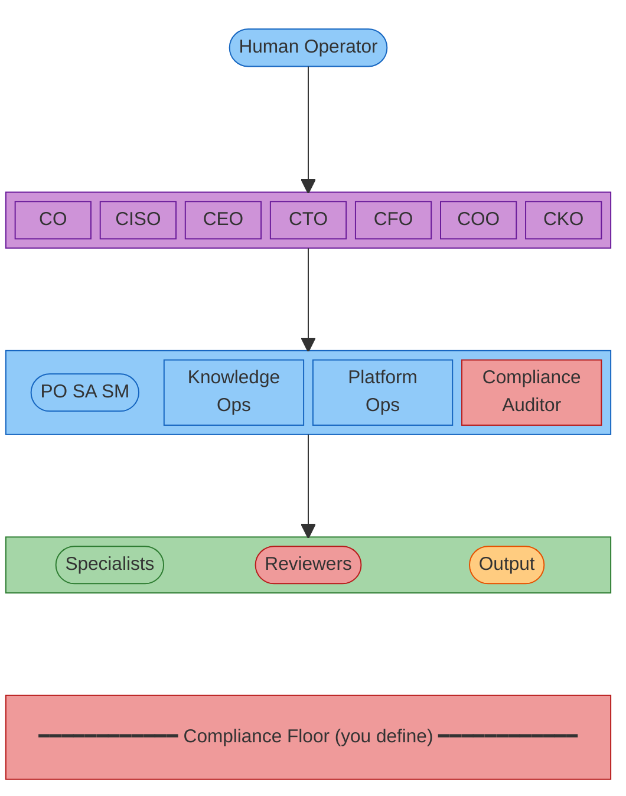
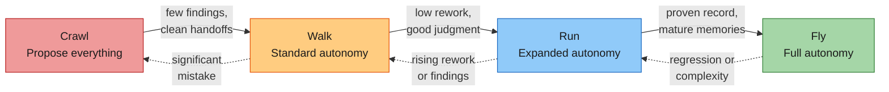
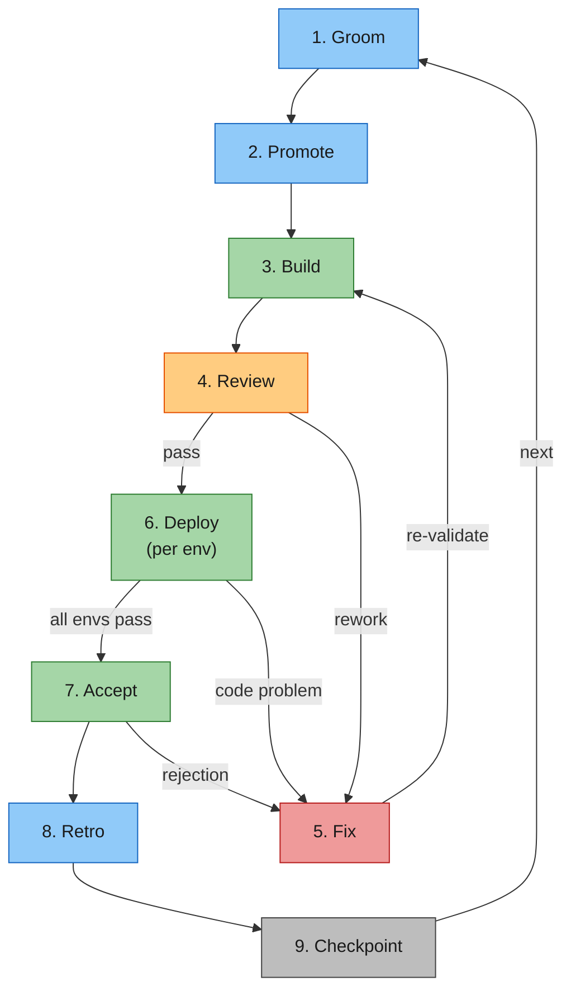
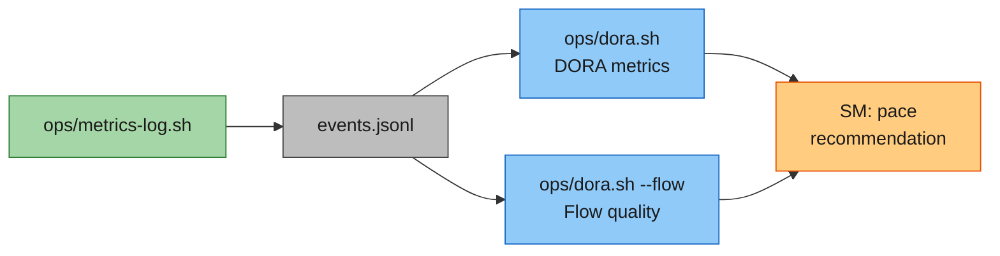
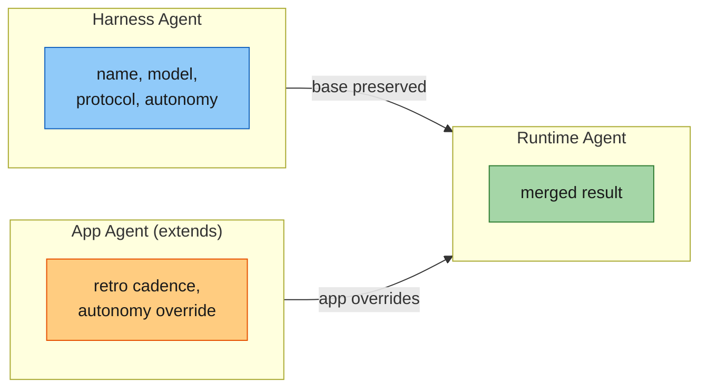

<p align="center">
  
</p>

<p align="center">
  <a href="LICENSE"></a>
</p>

# Venutian Antfarm

> **Read the blog post:** [Governing the Ant Farm — A Governance-First Framework for Multi-Agent Software Delivery](https://medium.com/@robdunie/governing-the-ant-farm-a-governance-first-framework-for-multi-agent-software-delivery-29245fc14bd9)

An agent fleet harness framework for structured multi-agent software delivery with progressive autonomy, evidence-based governance, and measurable quality control. Clone it, define your compliance floor, add your specialist agents, and start delivering with a governed fleet.

## Why Venutian Antfarm?

- **Governance-first.** Compliance floor, change control, and audit trails are built in from day one — not bolted on after an incident. A 7-agent executive governance tier (CO, CISO, CEO, CTO, CFO, COO, CKO) sets policy independently of the operational chain.
- **Progressive autonomy.** Fleets start at Crawl (propose everything) and earn autonomy through measurable performance. Pace goes both directions — complexity triggers slowdowns, not just promotions.
- **Measurable delivery.** DORA metrics, flow quality, pathway analysis, and agent cost tracking out of the box. 26 event types, pluggable backends, and CLI dashboards. The fleet learns from its own data.
- **Extensible by design.** Define your compliance floor, add your specialist agents, override any skill or agent definition. The harness provides structure; you provide the domain.

## Quick Start

```bash
# 1. Clone the template
git clone https://github.com/rdunie/venutian-antfarm.git my-project
cd my-project

# 2. Define your compliance floor
cp templates/compliance-floor.md compliance-floor.md
# Edit compliance-floor.md with your domain's non-negotiable rules

# 3. Add your specialist agents
cp templates/agents/frontend-specialist.md .claude/agents/frontend-specialist.md
cp templates/agents/backend-specialist.md .claude/agents/backend-specialist.md
# Edit each to match your tech stack

# 4. Configure your fleet
cp templates/fleet-config.json fleet-config.json
# Edit fleet-config.json (metrics backend, deploy command, etc.)

# 5. Start working
# Open Claude Code in your project directory. The 13 core agents are ready.
# Your specialists extend them.
```

## Architecture



The **compliance floor** is a set of non-negotiable rules (MUST ALWAYS / MUST NEVER) that you define for your domain. Every agent in every tier must follow it — it overrides all autonomy levels, pace settings, and process decisions. The governance layer guards the floor through change control; the compliance-auditor verifies conformance during review. No agent can modify, bypass, or deprioritize a floor rule.

## What You Get

**13 core agents** across two tiers:

**Governance (7)** — Executive leadership that sets policy, standards, and controls independently of the operational chain:

| Agent                  | Role                   | What It Does                                                 |
| ---------------------- | ---------------------- | ------------------------------------------------------------ |
| **compliance-officer** | Compliance program     | Floor guardianship, change control, conformance monitoring   |
| **ciso**               | Security authority     | Security benchmarks, security controls, threat assessment    |
| **ceo**                | Strategic alignment    | Digital twin of implementer, mission/vision, executive brief |
| **cto**                | Technology enablement  | Technology floor, tech standards, architecture direction     |
| **cfo**                | Cost governance        | Token budget strategy, cost efficiency, resource allocation  |
| **coo**                | Operational efficiency | Process standards, SLAs, agent performance, retraining       |
| **cko**                | Knowledge quality      | Knowledge standards, distribution cadence, guidance registry |

**Operational (6)** — Leadership triad + cross-cutting agents that orchestrate and execute delivery:

| Agent                  | Role                 | What It Does                                                        |
| ---------------------- | -------------------- | ------------------------------------------------------------------- |
| **product-owner**      | Business context     | Backlog management, prioritization (WSJF), acceptance, quality gate |
| **solution-architect** | Technical context    | NFRs, architecture decisions, cross-system coherence                |
| **scrum-master**       | Process facilitation | Pace control, findings reviews, conflict resolution, retros         |
| **knowledge-ops**      | Knowledge operations | Memory consistency, learning distribution (under CKO direction)     |
| **platform-ops**       | Dev platform         | DORA metrics, CI/CD, cross-environment visibility                   |
| **compliance-auditor** | Compliance review    | Audits work output against compliance floor rules during Review     |

### Progressive Autonomy



Every fleet starts at Crawl. Evidence-based transitions only. Pace goes both directions — complexity or quality issues trigger fallback to a lower pace.

### Work Item Lifecycle



### Metrics Pipeline

DORA + flow quality metrics out of the box, with a pluggable backend (JSONL default, webhook/StatsD/OpenTelemetry configurable). 26 event types tracked across delivery, quality, agent cost, PR lifecycle, compliance, and governance categories.



See the [Metrics Guide](docs/METRICS-GUIDE.md) for all event types, dashboard examples, and how agents adapt their behavior based on metrics feedback.

### Agent Inheritance



App fields override harness fields. Unmentioned harness fields are preserved.

## Key Concepts

- **Compliance Floor**: Non-negotiable rules (MUST ALWAYS / MUST NEVER) that override all autonomy tiers and pace settings. The compliance-officer guards the floor; changes require user approval. See the [three-tier compliance hierarchy](.claude/COLLABORATION.md) (floor/targets/guidance).
- **Findings Loop**: Structured learning where agents record notable events, the SM curates refinements, and the CKO directs knowledge-ops to distribute learnings fleet-wide. The same finding type should decrease over time.
- **Fix Ownership**: The agent that authored the code is responsible for fixing it, regardless of where the issue was discovered. Diagnosis is collaborative; the fix returns to the author so the learning stays with them.
- **Environment Discipline**: All code changes happen in dev only. Agents may diagnose in any environment (read-only), but fixes flow through the deployment chain: branch, PR, merge, deploy through promotion order.

## Skills

| Skill         | What It Does                                                   | Primary Agent      |
| ------------- | -------------------------------------------------------------- | ------------------ |
| `/po`         | Backlog management, prioritization, grooming, review           | product-owner      |
| `/retro`      | Run a retrospective for a completed work item                  | scrum-master       |
| `/onboard`    | Interactive project setup                                      | --                 |
| `/handoff`    | Structured agent-to-agent handoff with metrics logging         | all agents         |
| `/deploy`     | Two-step merge + deploy through promotion order                | platform-ops       |
| `/findings`   | Findings register: log, review, triage, patterns               | scrum-master       |
| `/audit`      | Compliance audit against the compliance floor                  | compliance-auditor |
| `/pace`       | Pace control: status, evaluation, transitions                  | scrum-master       |
| `/memory`     | Knowledge management: audit, distribute, optimize, gaps        | knowledge-ops      |
| `/compliance` | Compliance program: propose, review, apply, audit, log         | compliance-officer |
| `/governance` | Executive governance: brief, decisions, guidance, CEO autonomy | ceo                |

All skills can be overridden by implementers. Create `.claude/skills/<name>/SKILL.md` in your project to replace the harness default.

## Documentation

- **[Governing the Ant Farm](https://medium.com/@robdunie/governing-the-ant-farm-a-governance-first-framework-for-multi-agent-software-delivery-29245fc14bd9)** -- Blog post introducing the framework's philosophy and design
- **[Getting Started](docs/GETTING-STARTED.md)** -- Step-by-step onboarding guide
- **[Agent Fleet Pattern](docs/AGENT-FLEET-PATTERN.md)** -- The full pattern specification
- **[Collaboration Protocol](.claude/COLLABORATION.md)** -- How agents work together
- **[Collaboration Model](docs/COLLABORATION-MODEL.md)** -- Visual diagrams
- **[Metrics Guide](docs/METRICS-GUIDE.md)** -- Event types, dashboards, extending metrics, example output
- **[Pathway Analysis](docs/PATHWAY-ANALYSIS.md)** -- Agent communication pathway analysis: declaring, interpreting, governance
- **[Example App](example/)** -- Working example with 2 specialist agents

## License

Copyright 2026 [RD Digital Consulting Services, LLC](https://robdunie.com/). Dual-licensed under [AGPL 3.0](https://www.gnu.org/licenses/agpl-3.0.html) (with app-layer exemption) and a commercial license. See [LICENSE](LICENSE).

**Open-source use:** Free for internal use, building products, consulting, and education. Your agents, compliance floors, and configs are your IP.

**Commercial license required for:** Offering the framework as a managed service/SaaS, reselling, or white-labeling. Contact [RD Digital Consulting Services, LLC](https://robdunie.com/).
