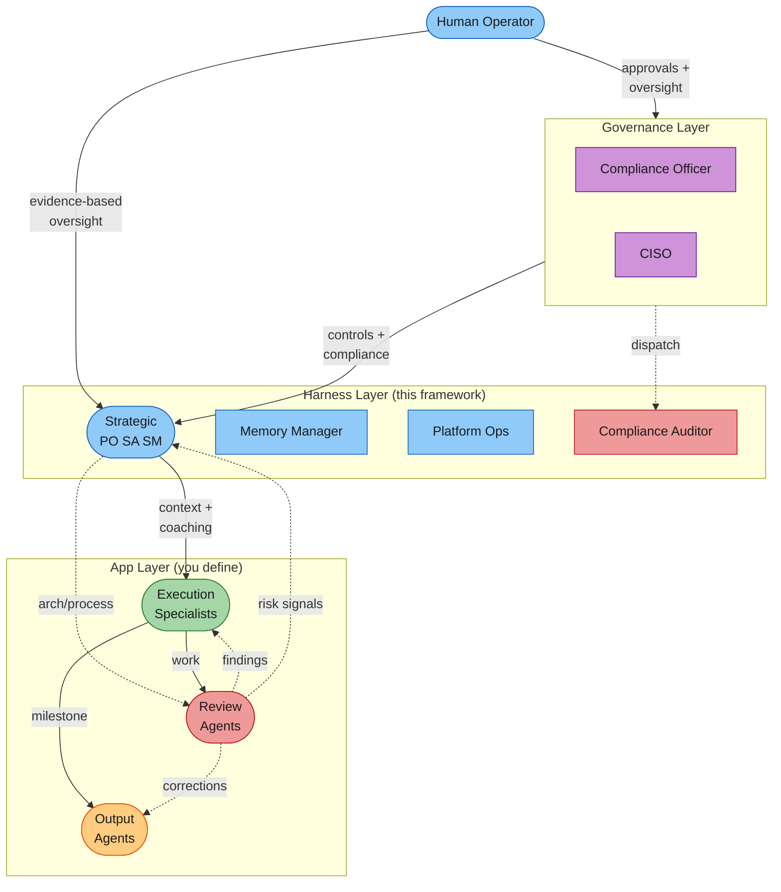
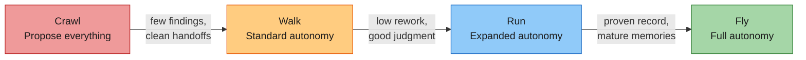
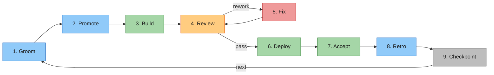
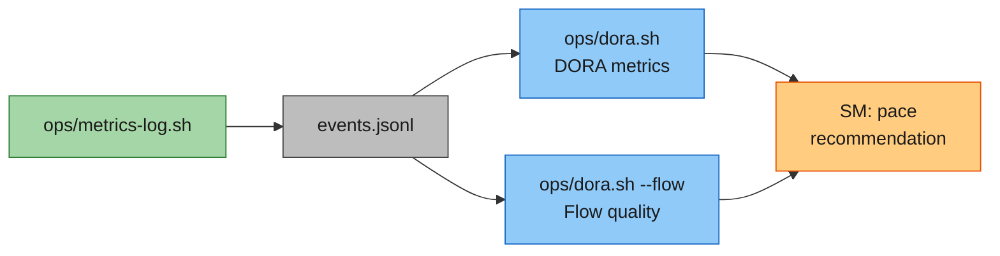
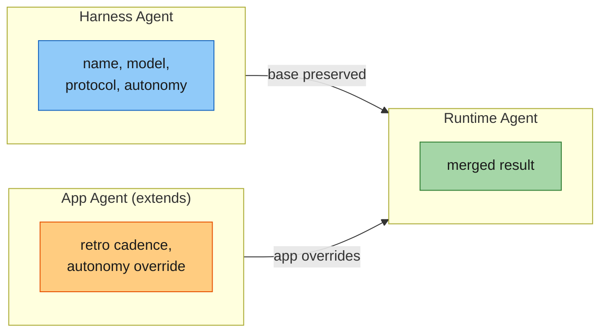

<p align="center">
  
</p>

<p align="center">
  <a href="LICENSE"></a>
</p>

# Venutian Antfarm

An agent fleet harness framework for structured multi-agent software delivery with progressive autonomy, evidence-based governance, and measurable quality control. Clone it, define your compliance floor, add your specialist agents, and start delivering with a governed fleet.

## Quick Start

```bash
# 1. Clone the template
git clone https://github.com/rdunie/venutian-antfarm.git my-project
cd my-project

# 2. Define your compliance floor
cp templates/compliance-floor.md compliance-floor.md
# Edit compliance-floor.md with your domain's non-negotiable rules

# 3. Add your specialist agents
cp templates/agents/frontend-specialist.md .claude/agents/frontend-specialist.md
cp templates/agents/backend-specialist.md .claude/agents/backend-specialist.md
# Edit each to match your tech stack

# 4. Configure your fleet
cp templates/fleet-config.json fleet-config.json
# Edit fleet-config.json (metrics backend, deploy command, etc.)

# 5. Start working
# Open Claude Code in your project directory. The 6 core agents
# (product-owner, solution-architect, scrum-master, memory-manager,
# platform-ops, compliance-auditor) are ready. Your specialists extend them.
```

## Architecture



## What You Get

**8 agents** across governance and operational tiers:

| Agent                  | Tier        | Role                 | What It Does                                                        |
| ---------------------- | ----------- | -------------------- | ------------------------------------------------------------------- |
| **compliance-officer** | Governance  | Compliance program   | Floor guardianship, change control, conformance monitoring          |
| **ciso**               | Governance  | Security authority   | Security benchmarks, security controls, threat assessment           |
| **product-owner**      | Strategic   | Business context     | Backlog management, prioritization (WSJF), acceptance, quality gate |
| **solution-architect** | Strategic   | Technical context    | NFRs, architecture decisions, cross-system coherence                |
| **scrum-master**       | Strategic   | Process facilitation | Pace control, findings reviews, conflict resolution, retros         |
| **memory-manager**     | Operational | Knowledge quality    | Memory consistency, learning distribution, stale detection          |
| **platform-ops**       | Operational | Dev platform         | DORA metrics, CI/CD, cross-environment visibility                   |
| **compliance-auditor** | Operational | Compliance review    | Audits work output against compliance floor rules during Review     |

### Progressive Autonomy



Every fleet starts at Crawl. Evidence-based transitions only. Pace goes both directions.

### Work Item Lifecycle



### Metrics Pipeline



DORA + flow quality metrics out of the box, with a pluggable backend (JSONL default, webhook/StatsD/OpenTelemetry configurable).

#### Example: Log events

```bash
$ ops/metrics-log.sh item-promoted 42
$ ops/metrics-log.sh handoff-sent 42 --from backend-specialist --to security-reviewer
$ ops/metrics-log.sh bug-found 42 --severity high --source regression
$ ops/metrics-log.sh agent-invoked product-owner --tokens 45800 --turns 10 --model opus --item 42
```

#### Example: `ops/dora.sh`

```
================================================================
                     DORA METRICS
================================================================

  DEPLOYMENT FREQUENCY (since 2026-02-17)
    deployments:   14
    item-accepted: 23
    total:         37

  LEAD TIME (item-promoted -> item-accepted)
    median: 1.75 sessions (25200s)

  CHANGE FAILURE RATE
    regressions: 2 / 23 items = 8%

  DEPLOYMENT REWORK RATE
    hotfix deploys: 3 / 14 = 21%

  MTTR (high/critical bugs)
    median: 0.38 sessions (5400s)

================================================================
                    FLOW QUALITY
================================================================

  FIRST-PASS YIELD (by handoff boundary)
    backend-specialist        -> security-reviewer         87%
    frontend-specialist       -> ux-reviewer               91%
    backend-specialist        -> compliance-auditor        95%
    infra-specialist          -> security-reviewer         100%
    Fleet average                                         92%

  REWORK CYCLES
    Average  0.4 cycles/item

  TASK OUTCOMES
    Abandoned  1 of 23 promoted = 4%
    Restarted  2 of 23 promoted = 8%

  BLOCKED TIME
    Average  0.25 sessions/item
```

#### Example: `ops/dora.sh --sm`

```
================================================================
                 PACE RECOMMENDATION
================================================================

  PACE RECOMMENDATION
    Current pace: Walk

  DORA signals
    CFR: 8% (Walk threshold: <=10%)

  Flow signals
    FPY: 92%

  Recommendation: Advance to Run
```

#### Example: `ops/dora.sh --cost`

```
================================================================
                 AGENT COST ANALYSIS
================================================================

  SUMMARY
    Total invocations: 87
    Total tokens:      1482300

  MODEL SPLIT
    opus: 34 calls, 892400 tokens
    sonnet: 48 calls, 561200 tokens
    haiku: 5 calls, 28700 tokens
```

#### Example: `ops/pathways.sh`

```
╔══════════════════════════════════════════════════════════════╗
║              COMMUNICATION PATHWAYS                        ║
╚══════════════════════════════════════════════════════════════╝

  ACTUAL PATHWAYS (inferred from handoff-sent events)

  From                           To                           Count
  ----                           --                           -----
  backend-specialist             security-reviewer            18
  frontend-specialist            ux-reviewer                  14
  backend-specialist             compliance-auditor           11
  infra-specialist               security-reviewer            7
  frontend-specialist            compliance-auditor           4

  FLEET DENSITY
    Active agents in handoffs: 5
    Unique communication paths: 5
    Density: 25% of possible paths (5/20)

  TOP COMMUNICATORS

  Agent                          Sent       Received   Total
  -----                          ----       --------   -----
  backend-specialist             29         0          29
  security-reviewer              0          25         25
  frontend-specialist            18         0          18
  compliance-auditor             0          15         15
  ux-reviewer                    0          14         14
  infra-specialist               7          0          7
```

### Agent Inheritance



App fields override harness fields. Unmentioned harness fields are preserved.

## Key Concepts

- **Compliance Floor**: Non-negotiable rules that override all autonomy tiers and pace settings. You define yours.
- **Findings Loop**: Structured learning where agents record notable events, the SM curates refinements, and the same finding type should decrease over time.

## Skills

| Skill         | What It Does                                           | Primary Agent      |
| ------------- | ------------------------------------------------------ | ------------------ |
| `/po`         | Backlog management, prioritization, grooming, review   | product-owner      |
| `/retro`      | Run a retrospective for a completed work item          | scrum-master       |
| `/onboard`    | Interactive project setup                              | --                 |
| `/handoff`    | Structured agent-to-agent handoff with metrics logging | all agents         |
| `/deploy`     | Deployment orchestration with pre/post validation      | platform-ops       |
| `/findings`   | Findings register: log, review, triage, patterns       | scrum-master       |
| `/audit`      | Compliance audit against the compliance floor          | compliance-auditor |
| `/pace`       | Pace control: status, evaluation, transitions          | scrum-master       |
| `/memory`     | Memory management: audit, distribute, optimize, gaps   | memory-manager     |
| `/compliance` | Compliance program: propose, review, apply, audit, log | compliance-officer |

All skills can be overridden by implementers. Create `.claude/skills/<name>/SKILL.md` in your project to replace the harness default.

## Documentation

- **[Governing the Ant Farm](https://medium.com/@robdunie/governing-the-ant-farm-a-governance-first-framework-for-multi-agent-software-delivery-29245fc14bd9)** -- Blog post introducing the framework's philosophy and design
- **[Getting Started](docs/GETTING-STARTED.md)** -- Step-by-step onboarding guide
- **[Agent Fleet Pattern](docs/AGENT-FLEET-PATTERN.md)** -- The full pattern specification
- **[Collaboration Protocol](.claude/COLLABORATION.md)** -- How agents work together
- **[Collaboration Model](docs/COLLABORATION-MODEL.md)** -- Visual diagrams
- **[Example App](example/)** -- Working example with 2 specialist agents

## License

Copyright 2026 [RD Digital Consulting Services, LLC](https://robdunie.com/). Dual-licensed under [AGPL 3.0](https://www.gnu.org/licenses/agpl-3.0.html) (with app-layer exemption) and a commercial license. See [LICENSE](LICENSE).

**Open-source use:** Free for internal use, building products, consulting, and education. Your agents, compliance floors, and configs are your IP.

**Commercial license required for:** Offering the framework as a managed service/SaaS, reselling, or white-labeling. Contact [RD Digital Consulting Services, LLC](https://robdunie.com/).
