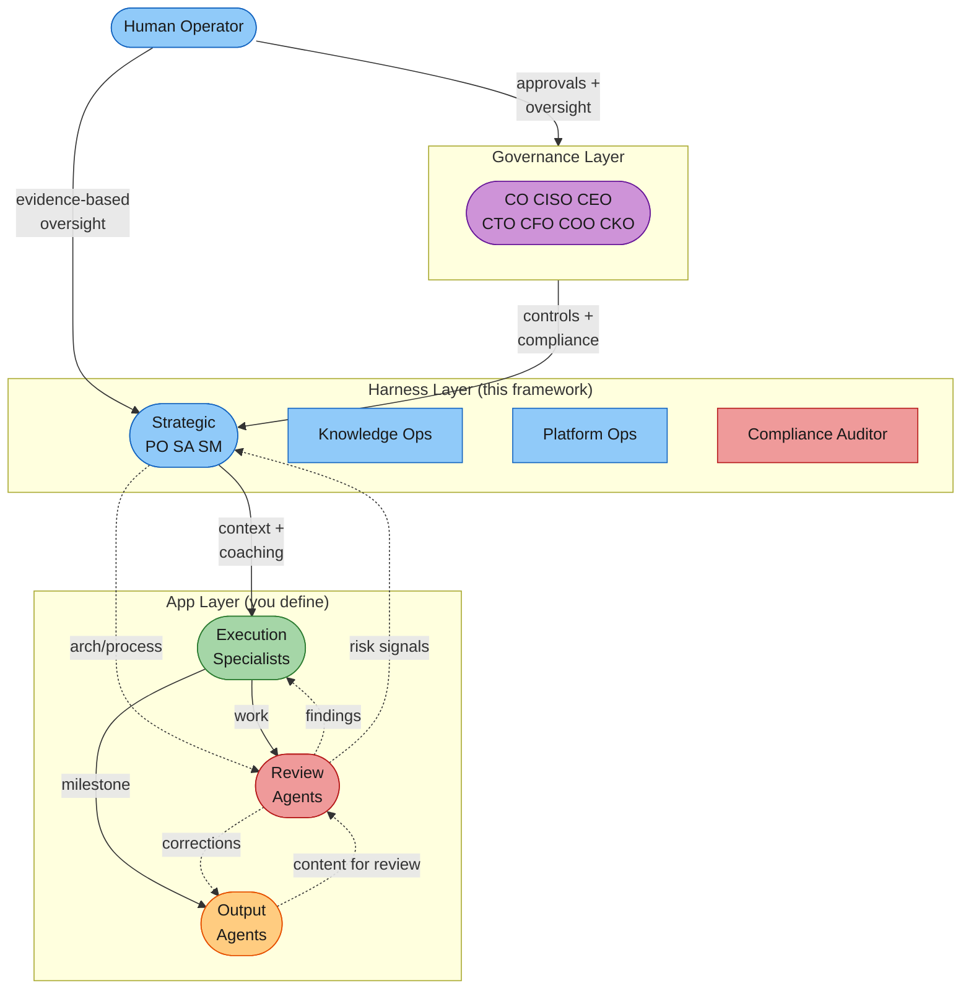

# The Governed Agent Fleet Pattern

_Part of [Venutian Antfarm](../README.md) by [RD Digital Consulting Services, LLC](https://robdunie.com/)._

A reusable architecture for multi-agent software delivery with progressive autonomy, structured governance, and evidence-based quality control.

**Origin:** Extracted from a production 16-agent fleet delivering a compliance-sensitive case management platform (PII-handling, legal domain, zero-knowledge data architecture, self-hosted Kubernetes). The pattern separates domain-specific implementation from generalizable fleet architecture. See the [introductory blog post](https://medium.com/@robdunie/governing-the-ant-farm-a-governance-first-framework-for-multi-agent-software-delivery-29245fc14bd9) for the philosophy behind this approach.

**Last updated:** 2026-03-18

---

## When to Use This Pattern

This pattern applies when:

- Your project requires **multiple specialized agents** working across different technical domains (frontend, backend, infrastructure, security, etc.)
- The domain has **compliance, governance, or safety requirements** that demand structured oversight rather than ad-hoc agent execution
- You want **progressive trust** rather than binary autonomy (all-or-nothing)
- You need **measurable delivery performance** across the agent fleet, not just individual task completion
- A single human operator oversees the fleet and needs efficient oversight mechanisms

This pattern is overkill for simple automation tasks, single-agent workflows, or projects without quality/compliance requirements.

---

## Governance Tier

The pattern includes an executive governance layer with 7 Cx roles (CO, CISO, CEO, CTO, CFO, COO, CKO) that set policy, standards, and controls independently of the operational chain. Each Cx role proposes floor rules (MUST) and targets (SHOULD) through the Compliance Officer's change control process. See `docs/superpowers/specs/2026-03-19-governance-layer-design.md` and `docs/superpowers/specs/2026-03-19-cx-governance-framework-design.md` for the full governance design.

---

## Pattern Overview



Four organizational layers, each with distinct responsibilities. Solid lines show primary work-product flow. Dotted lines show feedback and advisory flows. Note the bidirectional flow between Review and Output: output agents submit content for accuracy review, and reviewers send corrections back.

| Layer         | Purpose                                                      | Model Tier                 | Autonomy                                       |
| ------------- | ------------------------------------------------------------ | -------------------------- | ---------------------------------------------- |
| **Strategic** | Set direction, mentor specialists, make tradeoff decisions   | Expensive (high reasoning) | Propose to human                               |
| **Execution** | Build, test, deploy within owned domains                     | Mid-tier (task execution)  | Autonomous within domain                       |
| **Review**    | Validate outputs against cross-cutting concerns              | Mid-tier (analysis)        | Autonomous for findings, propose for blocks    |
| **Output**    | Produce stakeholder-facing materials from internal artifacts | Mid-tier (synthesis)       | Autonomous for drafts, propose for publication |

---

## Core Components

### 1. The Leadership Triad

Three strategic agents that collectively govern the fleet. Modeled on servant leadership: the triad exists to make specialists successful, not to command them.

| Role                   | Owns                                  | Key Question                        |
| ---------------------- | ------------------------------------- | ----------------------------------- |
| **Product Owner**      | Value, priority, acceptance           | "Are we building the right thing?"  |
| **Solution Architect** | Technical approach, constraints, NFRs | "Are we building it the right way?" |
| **Scrum Master**       | Process, pace, coordination, flow     | "Is our process serving the team?"  |

**How they collaborate:**

- **Grooming:** PO leads with business priority; SA evaluates technical implications; SM ensures items are right-sized for current pace
- **Solution alignment:** SA proposes technical approach; PO validates business need; SM checks process feasibility
- **Quality:** All three hold the standard (PO for function, SA for architecture, SM for process)
- **Coaching:** Each triad member coaches specialists in their domain, in the moment, not deferred

**Consensus protocol:** When the triad must make a recommendation:

- High consensus on conservative action (maintain or slow pace) -> inform operator, proceed
- High consensus on accelerating action -> unified recommendation to operator for approval
- Low consensus -> each member presents their perspective, operator decides

**Why a triad, not a single orchestrator:** A single orchestrator creates a bottleneck and a single point of failure for judgment. The triad creates checks and balances: PO can push for speed, SA can push back on technical debt, SM can mediate based on process evidence. This mirrors how effective human teams work.

### 2. Progressive Autonomy (Pace Control)

The fleet operates at a dynamic pace that adjusts based on evidence. This replaces binary "autonomous vs. supervised" with a graduated trust model.

| Pace      | Agent Behavior                                                                    | Human Engagement                                       | Evidence to Advance                       |
| --------- | --------------------------------------------------------------------------------- | ------------------------------------------------------ | ----------------------------------------- |
| **Crawl** | Propose nearly everything. Explain reasoning. Confirm before acting.              | Frequent check-ins. Review outputs together.           | Stable output, few surprises              |
| **Walk**  | Standard three-tier autonomy. Propose for cross-domain and judgment calls.        | Regular milestones. Review at completion.              | Low rework rate, clean handoffs           |
| **Run**   | Expanded autonomy. Chain work across items. Propose only for strategic decisions. | Batch oversight. Findings register is primary channel. | High first-pass yield, declining findings |
| **Fly**   | Full autonomy. Execute, commit, promote. Ask only when genuinely blocked.         | On-demand. Metrics-driven oversight.                   | Proven track record, mature memories      |

**Pace rules:**

1. Evidence-based transitions only. "Things feel good" is not evidence.
2. Pace goes both directions. Slowing down is discipline, not failure.
3. Fleet-wide pace. Individual agents don't run ahead of the fleet. Exception: new agents start at Crawl regardless.
4. Complexity overrides pace. A complex task at Fly pace still warrants Crawl-level scrutiny.
5. Significant problems trigger triad consultation before pace changes.

**What makes this different from simple human-in-the-loop:** Most frameworks offer a binary choice: approve each action, or let the agent run free. Progressive autonomy means the _default behavior_ of every agent changes based on earned trust. At Crawl, reading code is autonomous but proposing a fix requires approval. At Fly, the same fix is autonomous. The approval threshold shifts across the entire fleet simultaneously.

### 3. Findings Loop (Structured Learning)

Agents improve through a closed feedback loop, not just accumulated memory.

```
Work --> Finding --> Register --> Curate --> Review --> Apply --> Distribute
 ^                                                                    |
 +--------------------------------------------------------------------+
```

**What makes a finding "notable":**

- **Surprise** (unexpected outcome, good or bad)
- **Pattern** (same issue appearing repeatedly)
- **Boundary tension** (judgment call at the edge of autonomy)
- **Learning opportunity** (should change future behavior)
- **Success worth replicating** (something that worked notably well)

**Findings have urgency levels:**

| Urgency      | Example                                   | Response                         |
| ------------ | ----------------------------------------- | -------------------------------- |
| **Critical** | Security breach, data leak                | Escalate immediately. Stop work. |
| **High**     | Significant rework, architectural concern | Surface in next status check.    |
| **Normal**   | Boundary tension, pattern observed        | Accumulate. Review periodically. |
| **Low**      | Minor improvement, success to replicate   | Review when convenient.          |

**The SM curates findings into refinements:** updated agent prompts, memory, or autonomy tiers. The key metric is that the _same type of finding should decrease over time_. If it doesn't, the refinement didn't work.

### 4. Model Tiering

Not every task needs the most capable (and expensive) model. Tiering by task type controls cost without sacrificing quality.

| Task Type        | Model Tier              | When to Use                                                       |
| ---------------- | ----------------------- | ----------------------------------------------------------------- |
| **Judgment**     | Expensive (e.g., Opus)  | Grooming, prioritization, review, architecture, tradeoff analysis |
| **Coordination** | Mid-tier (e.g., Sonnet) | Status dashboards, health checks, template expansion, reporting   |
| **Routine**      | Cheap (e.g., Haiku)     | File checks, validation, line counts, index verification          |

**Monitoring rule:** If the expensive model exceeds 40% of dispatches, investigate. Some judgment tasks can be downgraded with better context enrichment.

**Thinking-time caps:** Model selection and thinking budget are separate cost axes. Cap thinking at medium for judgment, low for coordination, none for routine. If an agent hits the ceiling, that's a finding: the task was mis-classified or needs better context.

### 5. Enforcement Mechanisms

Three layers of enforcement, from cheapest to most thorough:

| Layer                 | Mechanism                           | Cost                 | Reliability         | Best For                                       |
| --------------------- | ----------------------------------- | -------------------- | ------------------- | ---------------------------------------------- |
| **Hooks**             | Shell scripts on tool events        | Zero LLM tokens      | Deterministic       | File-level guards, formatting, drift detection |
| **Memory**            | Persisted behavioral rules          | Token cost on recall | Probabilistic       | Cross-session guidance, preferences, context   |
| **Skills/Checklists** | Loaded prompts with mandatory steps | Token cost on load   | High (forced steps) | Complex multi-step workflows                   |

**Hook categories to implement:**

| Hook Event       | Purpose                    | Example                                                            |
| ---------------- | -------------------------- | ------------------------------------------------------------------ |
| **PreToolUse**   | Block dangerous operations | Prevent edits to secrets files, enforce PII isolation              |
| **PostToolUse**  | Auto-fix and remind        | Run formatters, detect doc drift, suggest reviews                  |
| **SessionStart** | Set context                | Display pace, fleet status, recommended next action                |
| **SubagentStop** | Track and prompt           | Log agent completion, suggest findings review                      |
| **PreCompact**   | Preserve context           | Inject critical architectural constraints before memory compaction |

**Compliance floor:** Non-negotiable rules that override all autonomy tiers, pace settings, and process. Define these for your domain. They should be short (3-5 rules), absolute, and enforced by hooks where possible.

### 6. Delivery Metrics (DORA + Flow Quality)

Two complementary metric groups provide evidence for pace decisions and process improvements.

**DORA metrics (delivery outcomes):**

| Metric               | Measures                         | Pace Gate                    |
| -------------------- | -------------------------------- | ---------------------------- |
| Deployment frequency | How often the fleet ships        | Trend: increasing            |
| Lead time            | Promoted to accepted             | Trend: decreasing            |
| Change failure rate  | % of accepted items that regress | < 10% for Walk, < 5% for Run |
| MTTR                 | Time from bug-found to bug-fixed | Trend: decreasing            |

**Flow quality metrics (process health):**

| Metric                 | Measures                                 | Interpretation                 |
| ---------------------- | ---------------------------------------- | ------------------------------ |
| First-pass yield (FPY) | % of handoffs accepted without rejection | Handoff quality between agents |
| Rework cycles          | Fix passes before acceptance             | Process effectiveness          |
| Task restart rate      | % of items restarted mid-execution       | Grooming quality               |
| Blocked time           | % of lead time spent waiting             | Coordination efficiency        |

**FPY by boundary pair** is the most actionable metric. If the backend-specialist -> security-reviewer boundary has low FPY, the grooming process needs to add security checkpoints earlier, or the backend-specialist's security awareness needs enrichment.

**Implementation:** An append-only event log (JSONL) with a CLI helper for logging events. A dashboard script reads the log and produces the metrics. Agents log events as part of their workflow, not as a separate step.

### 7. Work Item Lifecycle

Every work item flows through 9 phases:

| Phase             | What Happens                                                        | Who Leads      |
| ----------------- | ------------------------------------------------------------------- | -------------- |
| **1. Groom**      | Triad collaborates: acceptance criteria, sizing, NFRs, dependencies | PO leads       |
| **2. Promote**    | Expand to full work item with story, AC, NFRs                       | PO             |
| **3. Build**      | Specialists execute with TDD. Owner validates end-to-end.           | Specialists    |
| **4. Review**     | PO verifies AC. Selective specialist reviews dispatched.            | PO dispatches  |
| **5. Fix**        | Address review findings                                             | Domain owners  |
| **6. Deploy**     | Deploy to target environment. Run validation suite.                 | Platform-ops   |
| **7. Accept**     | All criteria pass. Item complete.                                   | PO             |
| **8. Retro**      | All participants reflect. Keep/change/try.                          | SM facilitates |
| **9. Checkpoint** | Process health assessment. Pace evaluation.                         | SM             |

**The build phase principle: shift-left validation.** The agent doing the work owns the full cycle: code, test, typecheck, build, deploy, UX validate. Handoffs happen at expertise boundaries (security review, architecture decisions), not at validation boundaries ("someone else should test this").

### 8. Coordination Architecture

**Two layers separate working state from published view:**

| Layer              | Tool                       | Purpose                                                |
| ------------------ | -------------------------- | ------------------------------------------------------ |
| **Working state**  | Task system (ephemeral)    | Findings, handoffs, WIP status, coordination noise     |
| **Published view** | Files (version-controlled) | User-facing progress, documented decisions, governance |

Agents coordinate via tasks. When work reaches a checkpoint, the relevant agent publishes results to files. The human sees clean, curated file updates, not coordination noise.

**Handoff protocol:** Every handoff includes: what was done, what's needed, relevant context, artifacts, and urgency. The receiving agent should be able to act without asking for clarification. Unclear handoffs are a finding.

**Parallel vs. sequential:** Default to sequential at Crawl/Walk (safer, easier to observe). Allow parallel at Run/Fly when agents work on different files with no merge risk.

---

## Adaptation Guide

To instantiate this pattern for your project:

### Step 1: Define Your Specialist Agents

Map your technical domains to execution agents. Each agent should own a clear domain boundary with its own codebase area, test suite, and documentation.

Example mappings:

| Domain           | Harness Template        | Your Equivalent                            |
| ---------------- | ----------------------- | ------------------------------------------ |
| Backend platform | backend-specialist      | django-expert, rails-specialist            |
| Data pipelines   | (create your own)       | airflow-engineer, kafka-specialist         |
| Frontend UI      | frontend-specialist     | react-engineer, flutter-specialist         |
| E2E testing      | e2e-test-engineer       | cypress-engineer, playwright-specialist    |
| Infrastructure   | infrastructure-ops      | terraform-engineer, helm-specialist        |
| Platform/CI      | platform-ops (included) | github-actions-engineer, devops-specialist |

**Sizing guidance:** Start with 3-5 execution agents covering your core domains. Add review agents as your compliance needs demand. The triad (PO, SA, SM) is constant regardless of fleet size.

### Step 2: Define Your Compliance Floor

Write 3-5 non-negotiable rules for your domain. These override everything.

Example (PII-sensitive case management system):

1. No PII in the operational database (zero-knowledge split)
2. Row-level access control enforced on every query
3. No data leaks through logs, LLM prompts, or external services
4. Free-text content scanned for sensitive data at write-time
5. Secrets managed through a vault, never hardcoded

### Step 3: Implement Enforcement Hooks

Start with:

1. **PreToolUse blocker** for your compliance floor rules
2. **PostToolUse formatter** for code quality baseline
3. **SessionStart context** for pace and status awareness
4. **PreCompact injector** for critical constraints that must survive memory compaction

### Step 4: Set Up the Metrics Pipeline

1. Create an event log format (JSONL recommended)
2. Write a CLI helper that agents use to log events (agents should never write JSON directly)
3. Build a dashboard script that reads the log and produces DORA + flow metrics
4. Define your pace gate thresholds (e.g., CFR < 10% for Walk)

### Step 5: Start at Crawl

Every fleet starts at Crawl. This is intentional. You learn more about your process at Crawl (where every action is visible) than at any other pace. Move to Walk only when the evidence supports it.

---

## Worked Example: Compliance-Sensitive Platform

This pattern was originally developed for a self-hosted platform with strict compliance requirements: PII isolation, role-based access control, audit trails, and incident response procedures. See the `example/` directory in this repository for a minimal working demonstration.

Key domain-specific elements from the original deployment:

| Pattern Element       | Implementation                                                                                                                                                                                  |
| --------------------- | ----------------------------------------------------------------------------------------------------------------------------------------------------------------------------------------------- |
| Compliance floor      | Data isolation (operational and identity databases separated), row-level access control, content filtering on free-text fields, secrets managed via vault                                       |
| Execution agents (6)  | Backend specialist, pipeline engineer, frontend specialist, E2E test engineer, infrastructure ops, platform/CI ops                                                                              |
| Review agents (4)     | Security reviewer, data compliance auditor, governance/audit compliance, knowledge-ops                                                                                                          |
| Output agents (3)     | Documentation quality validator, training content producer, stakeholder video producer                                                                                                          |
| Enforcement hooks (8) | Sensitive data blocker, secrets file blocker, auto-formatter, collaboration doc drift detector, commit-type detector, compact context injector, agent completion logger, session status display |
| Metrics               | 15 event types via CLI helper, DORA + flow quality dashboard                                                                                                                                    |
| Governance docs       | 4-document governance suite with PDF generation, risk registry, role matrix                                                                                                                     |
| Tech stack            | Headless CMS, SPA framework, workflow engine, PostgreSQL, Vault, Kubernetes                                                                                                                     |

**Fleet size rationale:** 16 agents emerged from the domain, not from a target number. Each agent was added when a specialist domain became large enough that generalist agents made recurring mistakes in it. The initial fleet was 5 agents (PO, SA, SM, backend specialist, infrastructure ops). Review and output agents were added as compliance requirements crystallized.

---

## Industry Comparison

Benchmarked against 10 multi-agent frameworks (March 2026):

| Dimension              | This Pattern                      | Nearest Competitor                | Gap                                 |
| ---------------------- | --------------------------------- | --------------------------------- | ----------------------------------- |
| Progressive autonomy   | 4-level pace with evidence gates  | None (binary HITL)                | Novel                               |
| Delivery metrics       | DORA + flow quality               | LangSmith (token/latency only)    | Significant                         |
| Governance enforcement | 3-layer (hooks + memory + skills) | Amazon Bedrock Cedar policies     | Different approach                  |
| Fleet specialization   | 4-layer org with triad            | Factory AI Droids                 | Deeper coordination                 |
| Findings loop          | Closed-loop with SM curation      | CrewAI 4-tier memory              | Stores facts, not process learnings |
| Production portability | Single-project depth              | CrewAI, LangGraph (multi-project) | Tradeoff: depth vs. breadth         |

The pattern sacrifices portability for governance depth. This is the right tradeoff for compliance-sensitive domains; it may not be for general-purpose agent orchestration.

---

## References (This Framework)

- `.claude/COLLABORATION.md` -- Full collaboration protocol (source of truth)
- `docs/COLLABORATION-MODEL.md` -- Visual collaboration model with Mermaid diagrams
- `.claude/agents/` -- Core agent definitions (13 files)
- `.claude/settings.json` -- Hook configuration
- `.mcp.json` -- Team-shared MCP server configuration
- `ops/metrics-log.sh` -- Event logging CLI (pluggable backend)
- `ops/dora.sh` -- DORA + flow quality metrics dashboard
- `ops/pathways.sh` -- Agent communication pathway analysis
- `templates/` -- Templates for specialist agents, compliance floor, fleet config
- `example/` -- Working example with 2 specialist agents
