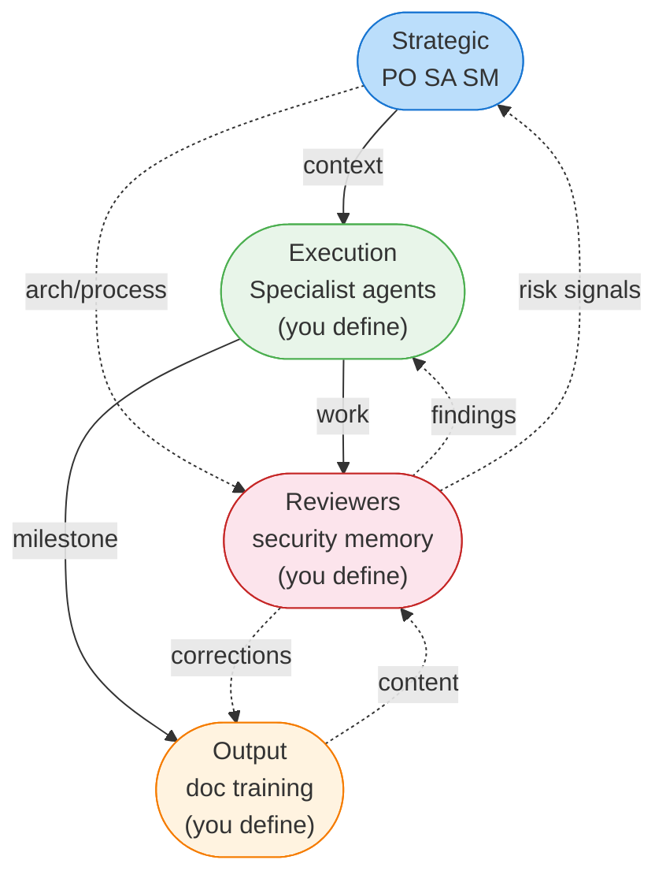
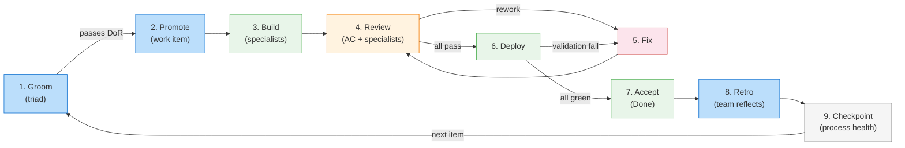
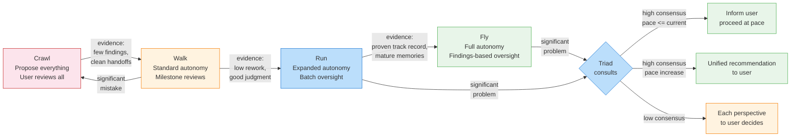
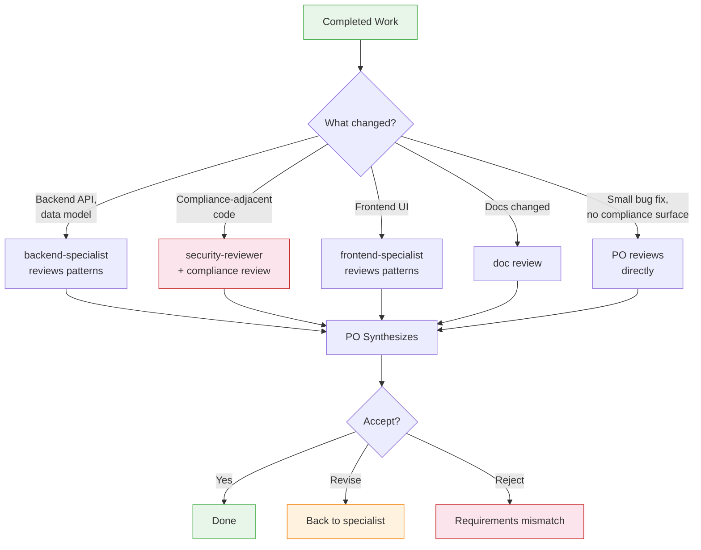
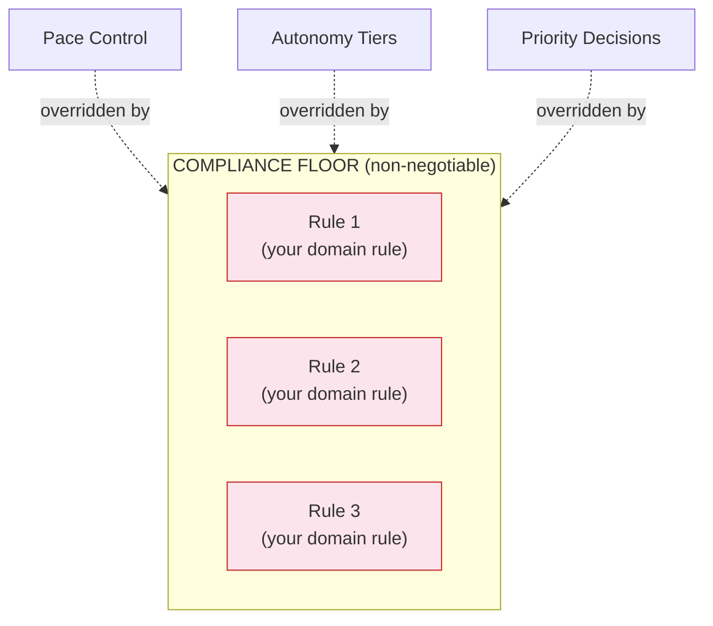
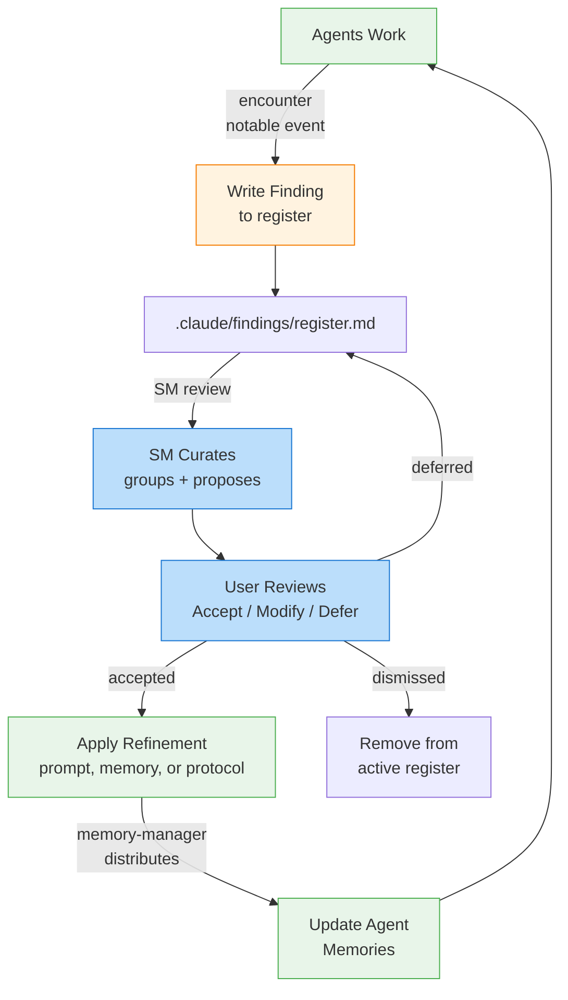
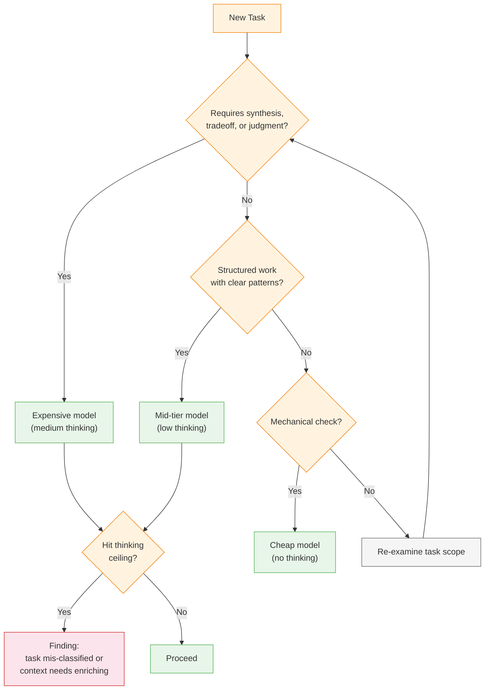
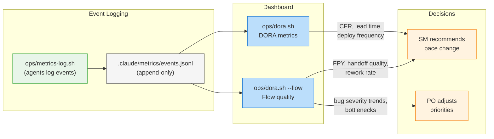
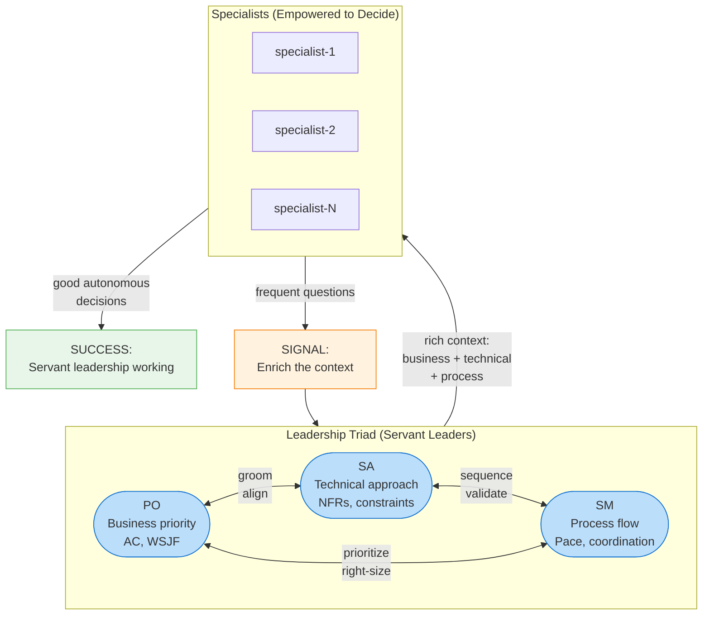

# Agent Collaboration Model

Visual guide to how the agent fleet collaborates. Source of truth for collaboration rules: `.claude/COLLABORATION.md`. Source of truth for documentation style: `.claude/DOCUMENTATION-STYLE.md`.

---

## Fleet Structure

Four organizational layers with distinct responsibilities. Solid lines show primary work-product flow. Dotted lines show feedback and advisory flows.

**Diamond layout**: Strategic at top feeds both Execution (context) and Reviewers (architecture/process). Execution and Reviewers interact laterally (work and findings). Both feed down to Output (milestones and corrections). Feedback flows back up (risk signals, content for review).

---

## Work Item Lifecycle

How a backlog item flows through the 9-phase lifecycle.

Key design decisions:

- **Phase 3: always-working software** -- builders run tests, typecheck, deploy, and validate before handing off
- **Phase 3: no bugs left behind** -- bugs found during build are fixed immediately
- **Phase 3: stop and reassess** -- if a task turns out larger or riskier than scoped, stop and flag it
- **Phase 8 (Retro)** -- all agents reflect; triad evaluates collectively before presenting to user

---

## Pace Control

The fleet operates at a dynamic pace. The scrum master monitors performance and recommends changes.

### Autonomy x Pace

How the three autonomy tiers shift as the fleet moves from Crawl to Fly.

```mermaid
flowchart TD
    subgraph CRAWL ["Crawl"]
        C_A["Autonomous\nRead, diagnose,\nresearch"]
        C_P["Propose\nAll builds, edits,\ndeploys, handoffs"]
        C_E["Escalate\nCompliance floor,\narchitectural"]
    end

    subgraph WALK ["Walk"]
        W_A["Autonomous\nWithin-domain routine"]
        W_P["Propose\nCross-domain work,\njudgment calls"]
        W_E["Escalate\nCompliance floor,\nstrategic decisions"]
    end

    subgraph RUN ["Run"]
        R_A["Autonomous\nChains across items,\nroutine deploys"]
        R_P["Propose\nArchitectural changes,\nstrategic direction"]
        R_E["Escalate\nCompliance floor\n(always)"]
    end

    subgraph FLY ["Fly"]
        F_A["Autonomous\nNearly everything,\nbatch oversight"]
        F_P["Propose\nOnly genuinely\nblocked items"]
        F_E["Escalate\nCompliance floor\n(always)"]
    end

    CRAWL -->|"evidence:\nfew findings"| WALK
    WALK -->|"evidence:\nlow rework"| RUN
    RUN -->|"evidence:\nproven record"| FLY

    style C_A fill:#bbdefb,stroke:#1976D2
    style C_P fill:#fff3e0,stroke:#F57C00
    style C_E fill:#fce4ec,stroke:#C62828
    style W_A fill:#bbdefb,stroke:#1976D2
    style W_P fill:#fff3e0,stroke:#F57C00
    style W_E fill:#fce4ec,stroke:#C62828
    style R_A fill:#bbdefb,stroke:#1976D2
    style R_P fill:#fff3e0,stroke:#F57C00
    style R_E fill:#fce4ec,stroke:#C62828
    style F_A fill:#bbdefb,stroke:#1976D2
    style F_P fill:#fff3e0,stroke:#F57C00
    style F_E fill:#fce4ec,stroke:#C62828
```

**Key insight:** Compliance floor escalation never relaxes regardless of pace. The expanding blue (Autonomous) zone is the primary indicator of trust growth.

---

## Review Dispatch

The PO selectively dispatches reviewers based on what changed.

---

## Compliance Floor

The compliance floor overrides all other protocol elements. Visualized as a foundation that everything rests on.

Define your compliance floor in `compliance-floor.md` at the project root. See `templates/compliance-floor.md` for a starting template.

---

## Learning Loop

How the fleet improves over time through evidence-based refinement.

---

## Model Selection Decision Tree

Decision tree for choosing the right model tier and thinking budget.

---

## Delivery Metrics (DORA + Flow Quality)

How the fleet measures and improves delivery performance.

Key events tracked: `item-promoted`, `item-accepted`, `ext-deployed`, `bug-found`, `bug-fixed`, `handoff-sent`, `handoff-rejected`, `task-restarted`, `task-blocked`, `task-unblocked`, `regression-run`. Pace thresholds: CFR < 10% to Walk; < 5% to Run.

---

## Leadership Triad

The PO, SA, and SM form a servant leadership triad.

| Activity           | PO Leads              | SA Contributes                 | SM Contributes                 |
| ------------------ | --------------------- | ------------------------------ | ------------------------------ |
| Grooming           | Business priority, AC | Architectural implications     | Right-sizing for pace          |
| Solution alignment | Validates business    | Proposes technical approach    | Checks process feasibility     |
| Work organization  | Prioritizes items     | Sequences by dependencies      | Coordinates execution mode     |
| Quality            | Functional correctness| Architectural soundness        | Process discipline             |
