# Agent Collaboration Model

_Part of [Venutian Antfarm](../README.md) by [RD Digital Consulting Services, LLC](https://robdunie.com/)._

Visual guide to how the agent fleet collaborates. Source of truth for collaboration rules: `.claude/COLLABORATION.md`. Source of truth for documentation style: `.claude/DOCUMENTATION-STYLE.md`.

## Table of Contents

- [Fleet Structure](#fleet-structure)
- [Governance Tier Detail](#governance-tier-detail)
- [Leadership + Operational Tier Detail](#leadership--operational-tier-detail)
- [Governance ↔ Operational Bridge](#governance--operational-bridge)
- [Worktree Isolation](#worktree-isolation)
- [Work Item Lifecycle](#work-item-lifecycle)
- [Pace Control](#pace-control)
- [Review Dispatch](#review-dispatch)
- [Compliance Floor](#compliance-floor)
- [Learning Loop](#learning-loop)
- [Model Selection Decision Tree](#model-selection-decision-tree)
- [Delivery Metrics (DORA + Flow Quality)](#delivery-metrics-dora--flow-quality)
- [Leadership Triad](#leadership-triad)
- [Agent Inheritance](#agent-inheritance)
- [Memory Architecture](#memory-architecture)
- [Handoff Protocol](#handoff-protocol)
- [Coordination Layers](#coordination-layers)
- [Enforcement Layers](#enforcement-layers)
- [Conflict Resolution](#conflict-resolution)
- [Regression Testing](#regression-testing)
- [Budget & Resource Flow](#budget--resource-flow)
- [Milestone Release](#milestone-release)

---

## Fleet Structure

The fleet has three tiers: governance (sets policy), leadership (orchestrates delivery), and execution (builds and reviews). Authority flows down; data flows up.

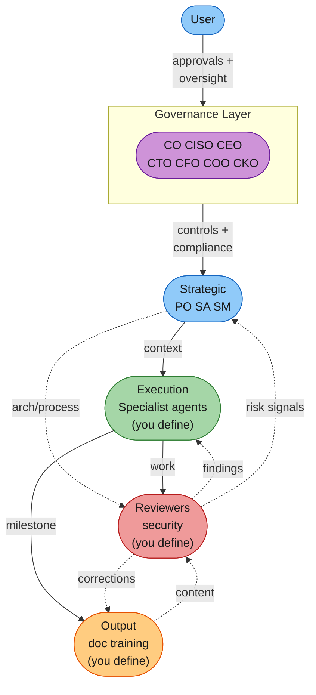

**Diamond layout**: Strategic at top feeds both Execution (context) and Reviewers (architecture/process). Execution and Reviewers interact laterally (work and findings). Both feed down to Output (milestones and corrections). Feedback flows back up (risk signals, content for review). The Governance layer sets policy above Strategic.

---

## Governance Tier Detail

The governance tier sets policy and standards. The CO is the compliance floor guardian -- all floor changes require user approval. Each Cx role proposes controls to the CO and participates in consensus when consulted. The CEO is the user's proxy and operates on an independent trust-based pace.

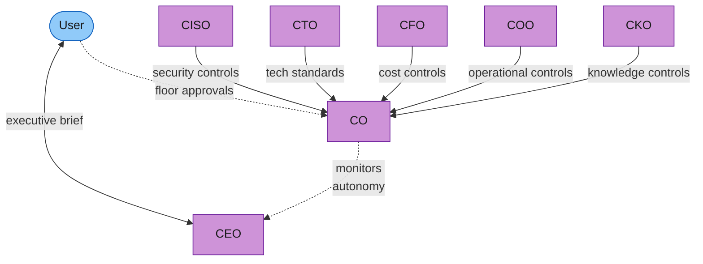

---

## Leadership + Operational Tier Detail

The leadership triad orchestrates day-to-day delivery. Operational agents execute within the standards set by governance. Specialists are defined per-project.

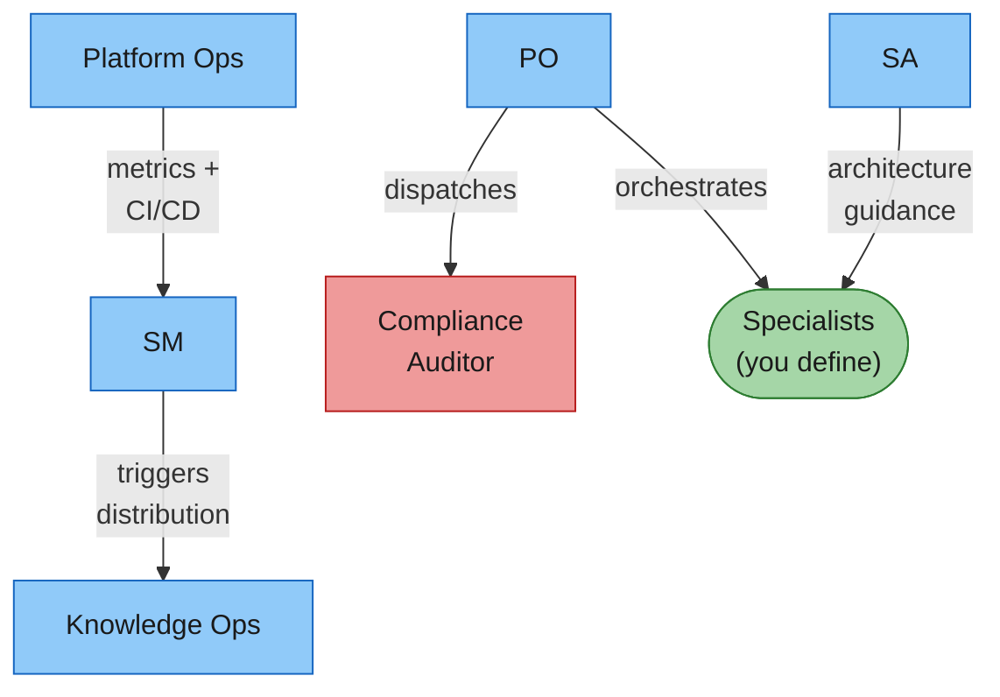

---

## Governance ↔ Operational Bridge

Governance sets the rules; operations follows them. Data flows up to inform governance decisions. The CO and CKO are the primary bridges.

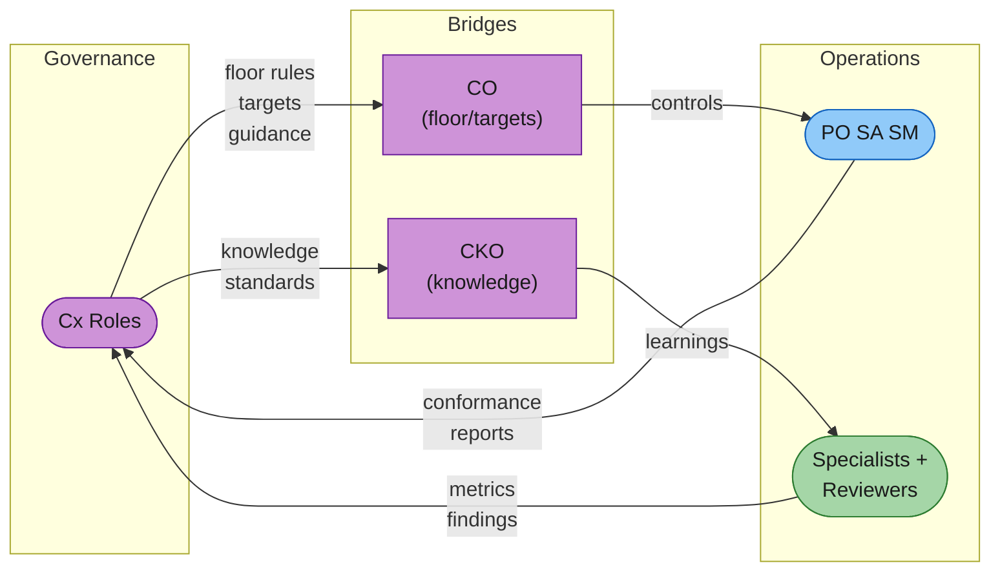

---

## Worktree Isolation

How agents access code depending on whether the task frontmatter specifies worktree isolation.

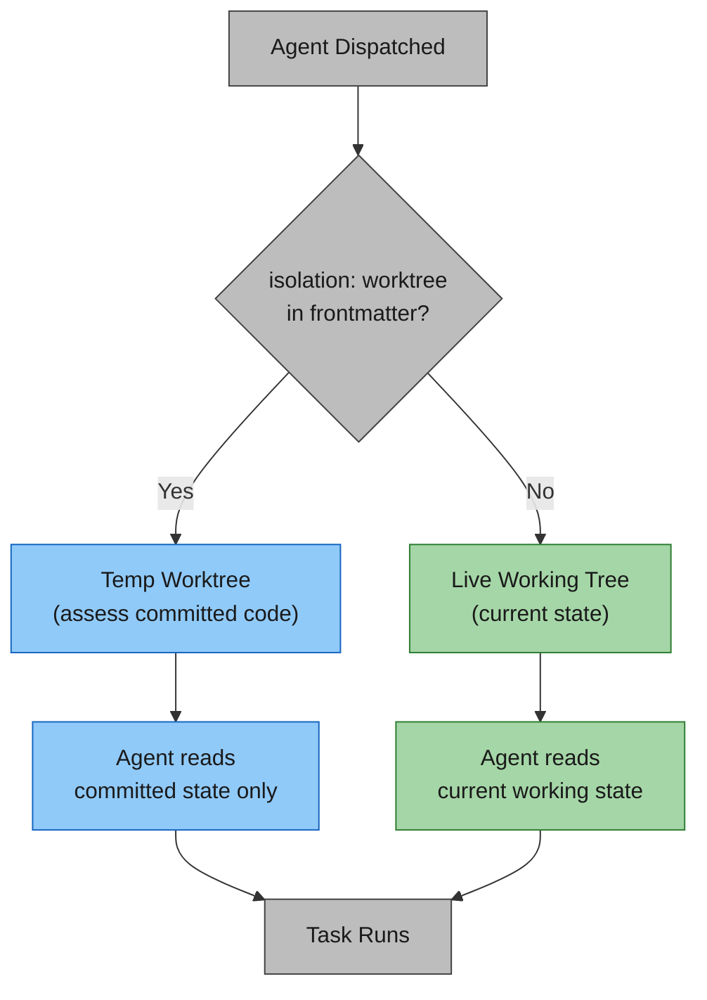

Use worktree isolation when you want a reviewer or auditor agent to assess only committed (stable) code rather than any in-flight edits. Set `isolation: worktree` in the agent task frontmatter.

---

## Work Item Lifecycle

How a backlog item flows through the 9-phase lifecycle.

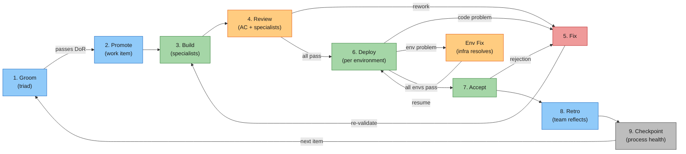

Key design decisions:

- **Phase 3: always-working software** -- builders run tests, typecheck, deploy, and validate before handing off
- **Phase 3: no bugs left behind** -- bugs found during build are fixed immediately
- **Phase 3: stop and reassess** -- if a task turns out larger or riskier than scoped, stop and flag it
- **Phase 8 (Retro)** -- all agents reflect; triad evaluates collectively before presenting to user

---

## Pace Control

The fleet operates at a dynamic pace. The scrum master monitors performance and recommends changes.

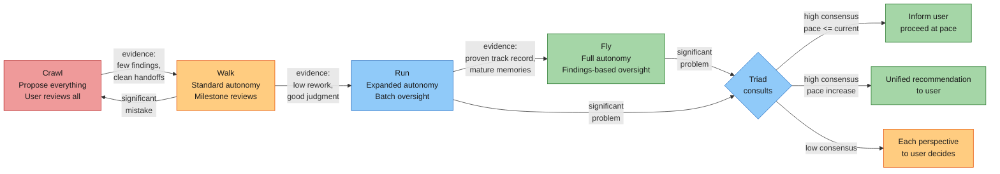

### Autonomy x Pace

How the three autonomy tiers shift as the fleet moves from Crawl to Fly.

```mermaid
flowchart TD
    subgraph CRAWL ["Crawl"]
        C_A["Autonomous\nRead, diagnose,\nresearch"]
        C_P["Propose\nAll builds, edits,\ndeploys, handoffs"]
        C_E["Escalate\nCompliance floor,\narchitectural"]
    end

    subgraph WALK ["Walk"]
        W_A["Autonomous\nWithin-domain routine"]
        W_P["Propose\nCross-domain work,\njudgment calls"]
        W_E["Escalate\nCompliance floor,\nstrategic decisions"]
    end

    subgraph RUN ["Run"]
        R_A["Autonomous\nChains across items,\nroutine deploys"]
        R_P["Propose\nArchitectural changes,\nstrategic direction"]
        R_E["Escalate\nCompliance floor\n(always)"]
    end

    subgraph FLY ["Fly"]
        F_A["Autonomous\nNearly everything,\nbatch oversight"]
        F_P["Propose\nOnly genuinely\nblocked items"]
        F_E["Escalate\nCompliance floor\n(always)"]
    end

    CRAWL -->|"evidence:\nfew findings"| WALK
    WALK -->|"evidence:\nlow rework"| RUN
    RUN -->|"evidence:\nproven record"| FLY

    style C_A fill:#90caf9,stroke:#1565c0,color:#1a1a1a
    style C_P fill:#ffcc80,stroke:#e65100,color:#1a1a1a
    style C_E fill:#ef9a9a,stroke:#b71c1c,color:#1a1a1a
    style W_A fill:#90caf9,stroke:#1565c0,color:#1a1a1a
    style W_P fill:#ffcc80,stroke:#e65100,color:#1a1a1a
    style W_E fill:#ef9a9a,stroke:#b71c1c,color:#1a1a1a
    style R_A fill:#90caf9,stroke:#1565c0,color:#1a1a1a
    style R_P fill:#ffcc80,stroke:#e65100,color:#1a1a1a
    style R_E fill:#ef9a9a,stroke:#b71c1c,color:#1a1a1a
    style F_A fill:#90caf9,stroke:#1565c0,color:#1a1a1a
    style F_P fill:#ffcc80,stroke:#e65100,color:#1a1a1a
    style F_E fill:#ef9a9a,stroke:#b71c1c,color:#1a1a1a
```

**Key insight:** Compliance floor escalation never relaxes regardless of pace. The expanding blue (Autonomous) zone is the primary indicator of trust growth.

---

## Review Dispatch

The PO selectively dispatches reviewers based on what changed.

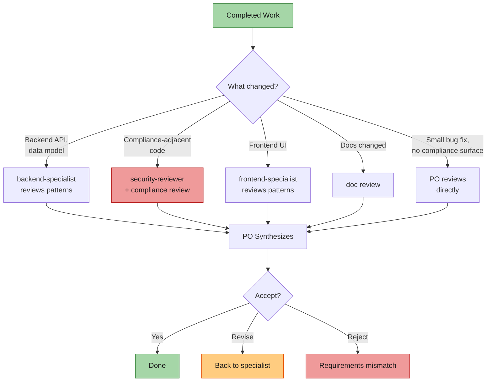

---

## Compliance Floor

The compliance floor overrides all other protocol elements. Visualized as a foundation that everything rests on.

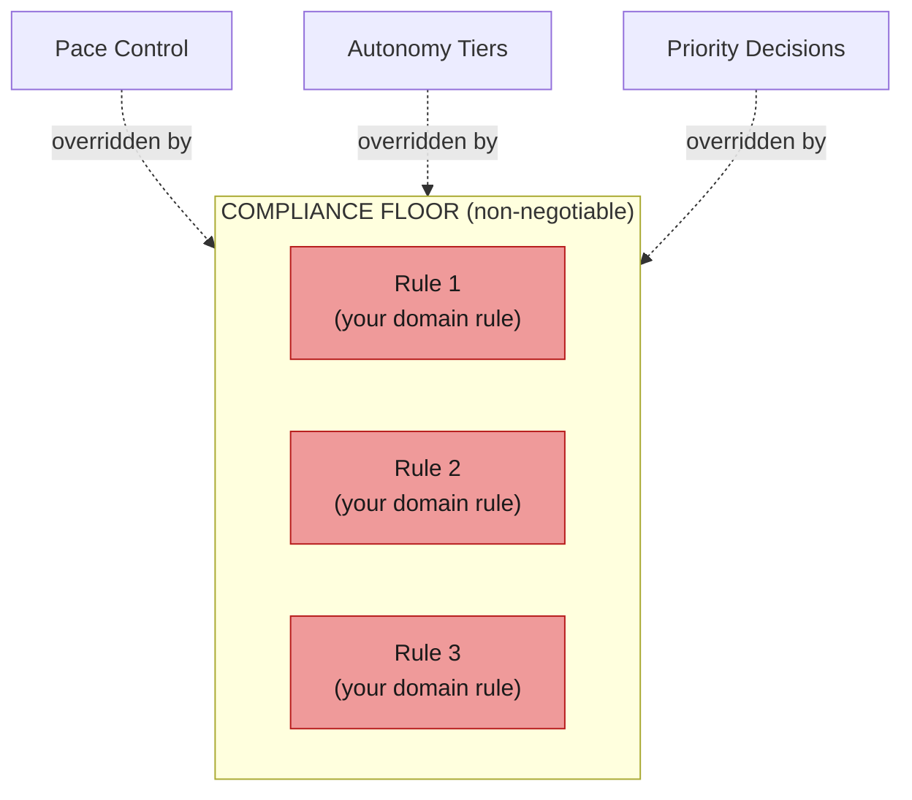

Define your compliance floor in `compliance-floor.md` at the project root. See `templates/compliance-floor.md` for a starting template.

---

## Learning Loop

How the fleet improves over time through evidence-based refinement.

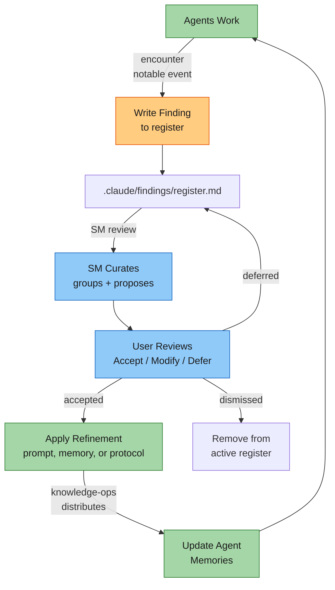

---

## Model Selection Decision Tree

Decision tree for choosing the right model tier and thinking budget.

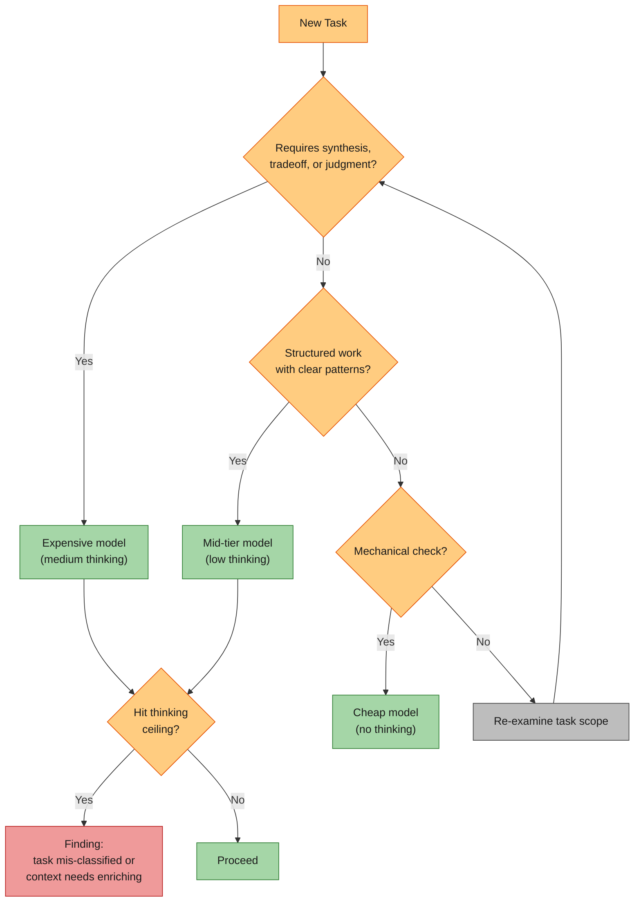

---

## Delivery Metrics (DORA + Flow Quality)

How the fleet measures and improves delivery performance.

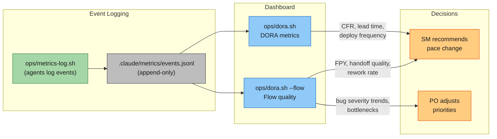

Key events tracked: `item-promoted`, `item-accepted`, `ext-deployed`, `bug-found`, `bug-fixed`, `handoff-sent`, `handoff-rejected`, `task-restarted`, `task-blocked`, `task-unblocked`, `regression-run`. Pace thresholds: CFR < 10% to Walk; < 5% to Run.

---

## Leadership Triad

The PO, SA, and SM form a servant leadership triad.

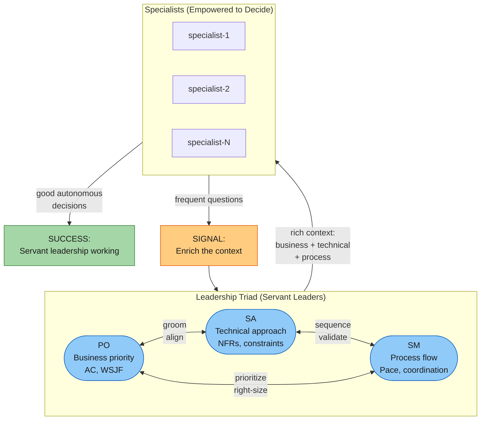

| Activity           | PO Leads               | SA Contributes              | SM Contributes             |
| ------------------ | ---------------------- | --------------------------- | -------------------------- |
| Grooming           | Business priority, AC  | Architectural implications  | Right-sizing for pace      |
| Solution alignment | Validates business     | Proposes technical approach | Checks process feasibility |
| Work organization  | Prioritizes items      | Sequences by dependencies   | Coordinates execution mode |
| Quality            | Functional correctness | Architectural soundness     | Process discipline         |

---

## Agent Inheritance

How app-level agents extend harness agents. The merge produces the runtime agent definition.

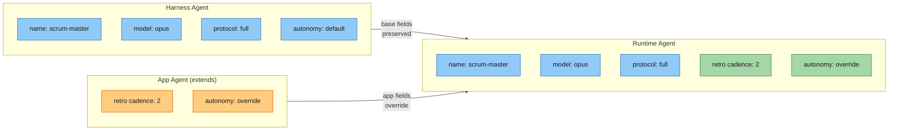

**Merge rules:** App fields (orange) override matching harness fields. Harness fields (blue) not mentioned in the app definition are preserved. Green fields in the merged result show where overrides landed.

---

## Memory Architecture

Two memory layers with distinct ownership. Knowledge-ops curates both (under CKO direction) and bridges them.

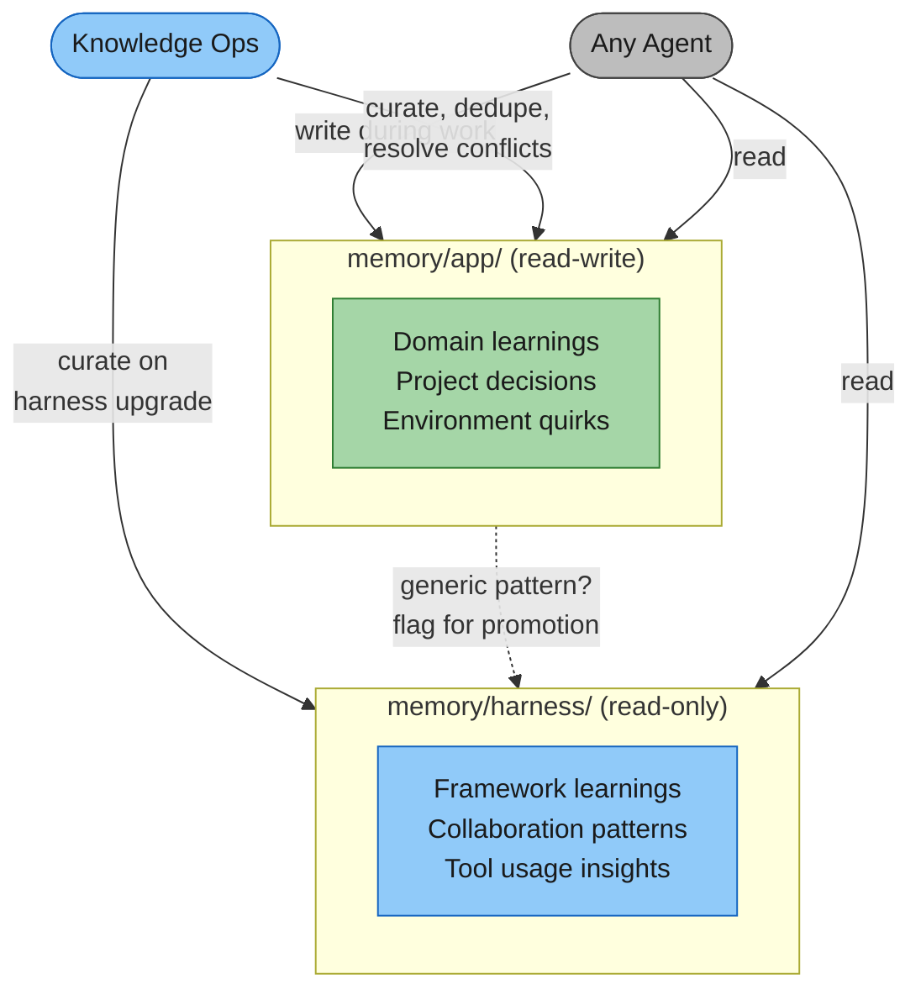

**Key constraint:** harness/ is read-only during normal operation. Only updated on harness version changes. app/ is where active learning accumulates.

---

## Handoff Protocol

How work transfers between agents with quality tracking.

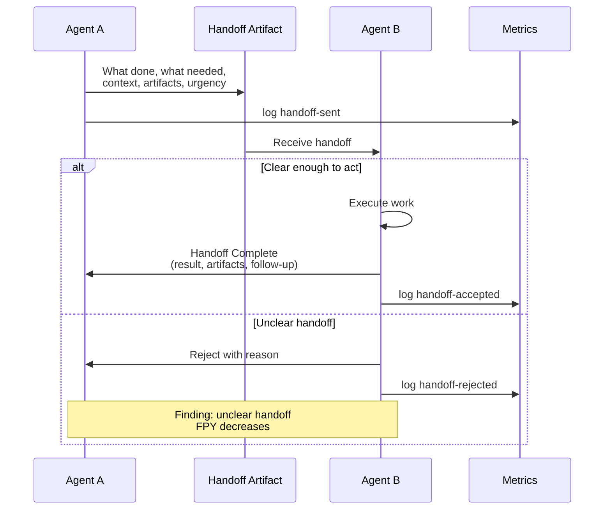

The receiving agent should be able to act without asking for clarification. FPY (first-pass yield) by boundary pair is the most actionable metric for handoff quality.

---

## Coordination Layers

Working state (ephemeral) and published view (version-controlled) serve different purposes.

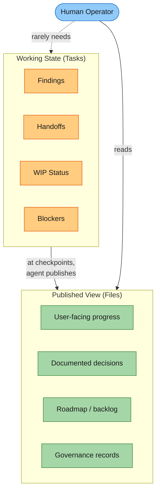

**Why this split:** Tasks handle concurrent work without write contention. Files stay clean and curated. The user sees checkpointed progress, not coordination noise.

---

## Enforcement Layers

Three enforcement mechanisms from cheapest to most thorough.

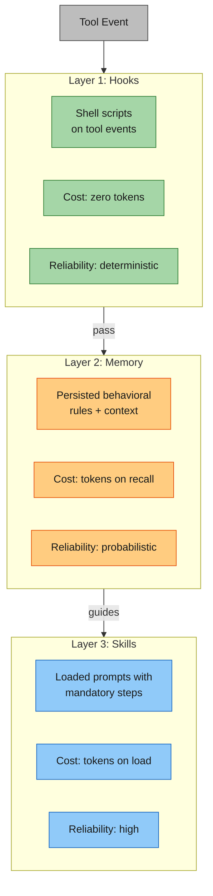

**When to use each:** Hooks for file-level guards and formatting (deterministic, free). Memory for cross-session behavioral guidance (probabilistic, cheap). Skills for complex multi-step workflows (reliable, most expensive).

---

## Conflict Resolution

How disagreements are routed to the right mediator.

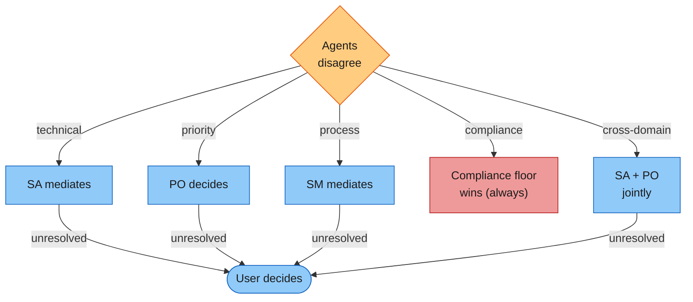

No agent overrides another agent's domain authority. Compliance floor takes precedence over all other disagreements without escalation.

---

## Regression Testing

Periodic validation cycle with cadence tuning.

```mermaid
flowchart LR
    COUNT["SM tracks\naccepted items"] -->|"every 3\n(tunable)"| TRIGGER["Trigger\nregression run"]

    TRIGGER --> BACK["Backend\nAPI, data, schema"]
    TRIGGER --> FRONT["Frontend\nUI, state, render"]
    TRIGGER --> E2E["Browser E2E\nAll roles, screenshots"]

    BACK --> FINDINGS["Regression\nfindings"]
    FRONT --> FINDINGS
    E2E --> FINDINGS

    FINDINGS -->|"add to backlog\n(do NOT fix inline)"| BACKLOG["PO prioritizes\nfixes"]
    FINDINGS -.->|"data informs"| TUNE{"Adjust\ncadence?"}
    TUNE -->|"regressions rare"| LESS["Extend to 5"]
    TUNE -->|"regressions frequent"| MORE["Tighten to 2"]

    style COUNT fill:#90caf9,stroke:#1565c0,color:#1a1a1a
    style TRIGGER fill:#ffcc80,stroke:#e65100,color:#1a1a1a
    style BACK fill:#a5d6a7,stroke:#2e7d32,color:#1a1a1a
    style FRONT fill:#a5d6a7,stroke:#2e7d32,color:#1a1a1a
    style E2E fill:#a5d6a7,stroke:#2e7d32,color:#1a1a1a
    style FINDINGS fill:#ef9a9a,stroke:#b71c1c,color:#1a1a1a
    style BACKLOG fill:#90caf9,stroke:#1565c0,color:#1a1a1a
    style TUNE fill:#ffcc80,stroke:#e65100,color:#1a1a1a
    style LESS fill:#bdbdbd,stroke:#424242,color:#1a1a1a
    style MORE fill:#bdbdbd,stroke:#424242,color:#1a1a1a
```

**Fix discipline:** Do not fix issues inline during regression testing. Record them as findings. Only fix roadblocks that prevent completing remaining tests.

---

## Budget & Resource Flow

How cost responsibility flows through the fleet.

```mermaid
flowchart LR
    PO_B(["Platform-ops\nmeasures costs"]) -->|"per item,\nper agent"| ALERT["Alert at\nthresholds"]
    SA_B(["SA estimates\nper-item budget"]) -->|"during grooming"| BUDGET["Item budget\n(NFR)"]
    ALERT -->|"push to"| SM_B(["SM decides\non overruns"])
    BUDGET --> SM_B
    SM_B -->|"pause, shift\nmodels, extend"| ACTION["Adjustment"]
    USER_B(["User sets\nbudget envelope"]) -.->|"total\ninvestment"| SM_B

    style PO_B fill:#90caf9,stroke:#1565c0,color:#1a1a1a
    style SA_B fill:#90caf9,stroke:#1565c0,color:#1a1a1a
    style SM_B fill:#ffcc80,stroke:#e65100,color:#1a1a1a
    style ALERT fill:#ef9a9a,stroke:#b71c1c,color:#1a1a1a
    style BUDGET fill:#bdbdbd,stroke:#424242,color:#1a1a1a
    style ACTION fill:#a5d6a7,stroke:#2e7d32,color:#1a1a1a
    style USER_B fill:#90caf9,stroke:#1565c0,color:#1a1a1a
```

**Monitoring rule:** If expensive model usage exceeds 40% of total dispatches, investigate whether some judgment tasks could be downgraded with better context enrichment.

---

## Milestone Release

Parallel dispatch to output agents when a batch of items reaches acceptance.

```mermaid
flowchart TD
    DECLARE["PO declares milestone\nversion tag + scope"] --> DISPATCH

    subgraph DISPATCH ["Parallel Dispatch (no dependencies)"]
        DOC["doc-quality\nChangelog, release notes"]
        TRAIN["training-enablement\nUser guides, walkthroughs"]
        COMMS["stakeholder-comms\nAnnouncements, demos"]
    end

    DOC --> TRACK["PO tracks\ncompletion"]
    TRAIN --> TRACK
    COMMS --> TRACK

    TRACK --> TAG["Version archive\ngit tag"]

    style DECLARE fill:#90caf9,stroke:#1565c0,color:#1a1a1a
    style DOC fill:#a5d6a7,stroke:#2e7d32,color:#1a1a1a
    style TRAIN fill:#a5d6a7,stroke:#2e7d32,color:#1a1a1a
    style COMMS fill:#a5d6a7,stroke:#2e7d32,color:#1a1a1a
    style TRACK fill:#ffcc80,stroke:#e65100,color:#1a1a1a
    style TAG fill:#bdbdbd,stroke:#424242,color:#1a1a1a
```

Output agents work independently from accepted items and current documentation. If one is blocked, the others continue.
