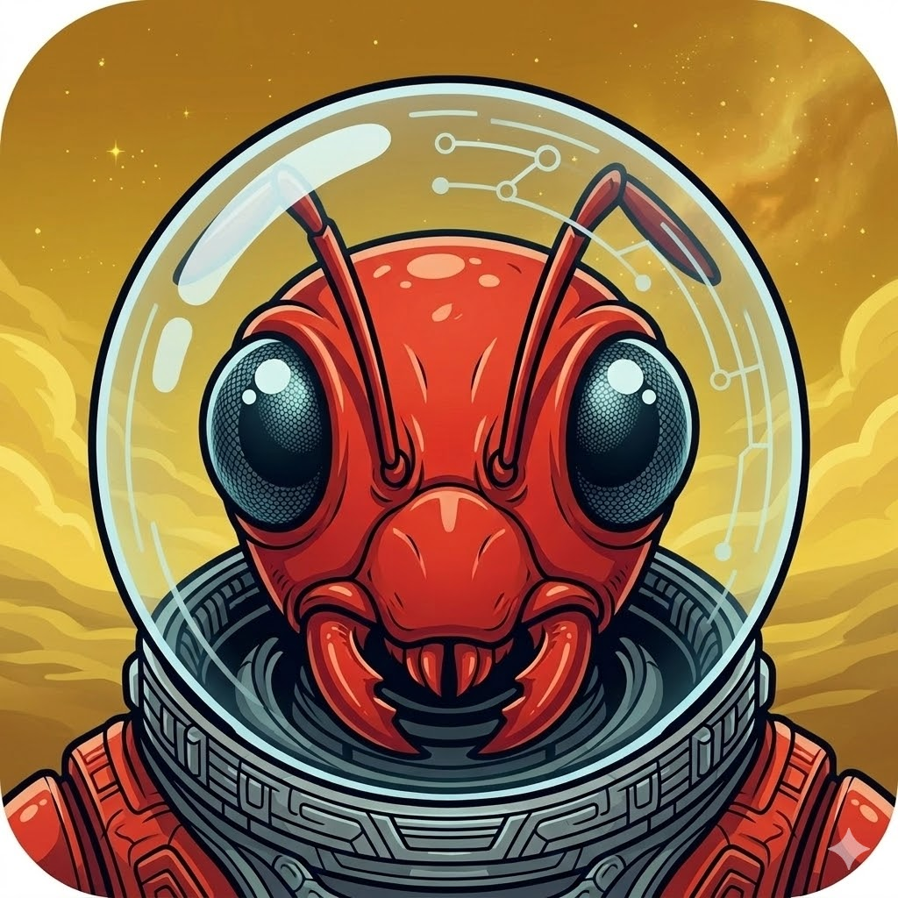
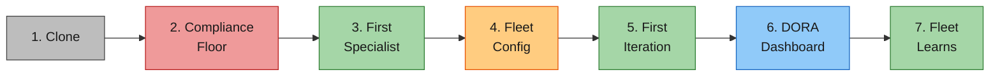

# Getting Started with Venutian Antfarm

_Part of [Venutian Antfarm](../README.md) by [RD Digital Consulting Services, LLC](https://robdunie.com/)._

A step-by-step guide to setting up your agent fleet harness. For background on the framework's philosophy, see [Governing the Ant Farm](https://medium.com/@robdunie/governing-the-ant-farm-a-governance-first-framework-for-multi-agent-software-delivery-29245fc14bd9).

## Prerequisites

- **Claude Code CLI** installed and configured
- **Git** for version control
- **jq** for metrics processing (optional but recommended)

## Setup Overview



## Step 1: Clone the Template

```bash
git clone https://github.com/rdunie/venutian-antfarm.git my-project
cd my-project
```

## Step 2: Define Your Compliance Floor

The compliance floor is the set of non-negotiable rules that every agent must follow, regardless of pace or autonomy level. It encompasses security, data governance, audit requirements, regulatory controls, and domain-specific rules.

```bash
cp templates/compliance-floor.md compliance-floor.md
```

Edit `compliance-floor.md` with your domain's rules. Keep it to 3-5 rules that are absolute, enforceable, and clear. For example:

- An e-commerce app might include: "No credit card numbers stored outside the payment processor"
- A healthcare app might include: "No PHI transmitted without encryption"
- A SaaS platform might include: "Tenant data isolation enforced on every query"

## Step 3: Add Your First Specialist Agent

Copy a template and customize it for your tech stack:

```bash
cp templates/agents/backend-specialist.md .claude/agents/backend-specialist.md
```

Edit the agent file to match your domain. The key sections to customize:

- **Domain**: What this agent owns (e.g., "Django REST API, PostgreSQL models, Celery tasks")
- **Responsibilities**: Specific to your project
- **Autonomy Model**: Start conservative, expand as trust builds

### Agent Inheritance

Your specialist agents can extend the harness core agents. Add an `extends` field to the frontmatter:

```yaml
---
extends: harness/scrum-master
---
# Your overrides here. For example, change retro cadence:
## Process Override
Retro cadence: every 2 items instead of every 1.
```

When `extends` is present:

- Fields in your app agent override the same fields in the harness agent
- Fields not mentioned in your app agent are preserved from the harness agent
- This lets you keep the full collaboration protocol while customizing behavior

## Step 4: Configure Your Fleet

```bash
cp templates/fleet-config.json fleet-config.json
```

Edit `fleet-config.json`:

- **project.name**: Your project name
- **metrics.backend**: Start with `"jsonl"` (works out of the box)
- **agents.specialists**: List your specialist agent names
- **retro.cadence**: How many items between retrospectives

## Step 5: Run Your First Iteration

Open Claude Code in your project directory. The 6 core agents are ready:

1. **Start with `/po`** to see the status overview
2. **Add a work item** to `docs/plans/` -- even a simple one like "Set up project structure"
3. **Run `/po groom`** to have the PO add acceptance criteria and WSJF score
4. **Build it** -- the specialist agent handles: code, test, typecheck, build, deploy, validate
5. **Run `/po review`** to verify against acceptance criteria

## Step 6: See Your DORA Dashboard

After completing a few items:

```bash
ops/dora.sh           # full DORA + flow quality dashboard
ops/dora.sh --sm      # pace recommendation
ops/dora.sh --flow    # handoff quality by boundary pair
```

The dashboard shows deployment frequency, lead time, change failure rate, first-pass yield by handoff boundary, rework cycles, and more.

## Step 7: The "Aha Moment"

As the fleet works through items, you will notice:

- **Findings decrease.** The same type of mistake stops recurring because the SM curates refinements into agent memories.
- **Handoffs get cleaner.** Agents learn what their counterparts need. FPY improves.
- **Pace naturally accelerates.** When CFR drops below 10% and FPY exceeds 80%, the SM recommends advancing from Crawl to Walk.
- **Specialists make good decisions autonomously.** The PO and SA invest in context enrichment, and it pays off -- specialists stop asking for every judgment call.

This is the fleet learning autonomy. Not because you told it to, but because the structured learning loop (findings, curation, refinement, distribution) compounds over time. Each iteration makes the next one smoother.

## Next Steps

- Read the [Agent Fleet Pattern](AGENT-FLEET-PATTERN.md) for the full specification
- Review the [Collaboration Protocol](../.claude/COLLABORATION.md) for all 11 core principles
- Check the [Example App](../example/) for a working 2-specialist setup
- Add review agents (security-reviewer, etc.) as your compliance needs crystallize
