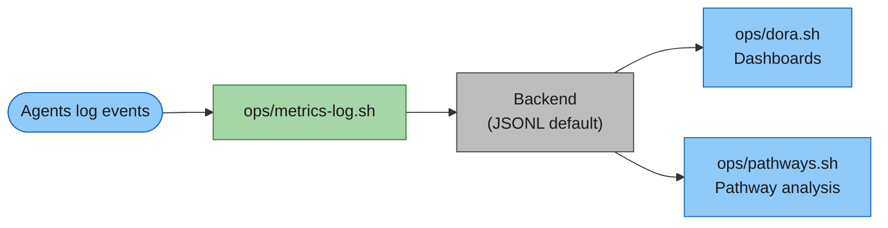

# Metrics Guide

_Part of [Venutian Antfarm](../README.md) by [RD Digital Consulting Services, LLC](https://robdunie.com/)._

A comprehensive guide to the framework's metrics system: what is measured, how to use the tools, how to extend with custom metrics, and what realistic output looks like for a mature fleet.

## How Metrics Work

All metrics flow through a single pipeline:



**Agents never write JSON directly.** All events go through `ops/metrics-log.sh`, which handles formatting, validation, and backend dispatch. The default backend is an append-only JSONL file (`.claude/metrics/events.jsonl`). The framework also supports webhook, StatsD, and OpenTelemetry backends (configured in `fleet-config.json`).

## Event Types

The framework tracks 26 event types across 5 categories.

### Delivery Events

Track the flow of work items through the lifecycle.

| Event                         | When Logged                            | Who Logs         | Key Args                             |
| ----------------------------- | -------------------------------------- | ---------------- | ------------------------------------ |
| `item-promoted`               | Item moves from backlog to active work | PO               | `<item-id>`                          |
| `item-accepted`               | Item passes DoD on final environment   | PO               | `<item-id>`                          |
| `item-rejected-at-build`      | Promoted item rejected at build start  | Specialist or PO | `--reason <reason> --source <agent>` |
| `item-rejected-at-acceptance` | Deployed work fails DoD verification   | PO               | `--reason <description>`             |
| `ext-deployed`                | Code deployed to an environment        | Specialist       | `--env <env> --type planned\|hotfix` |

### Quality Events

Track bugs, handoffs, and rework.

| Event              | When Logged                             | Who Logs          | Key Args                                        |
| ------------------ | --------------------------------------- | ----------------- | ----------------------------------------------- |
| `bug-found`        | Bug discovered during any phase         | Whoever discovers | `--severity high\|critical --source regression` |
| `bug-fixed`        | Bug fix verified                        | Whoever fixes     | `--bug-id <id>`                                 |
| `handoff-sent`     | Work handed from one agent to another   | Sending agent     | `--from <agent> --to <agent>`                   |
| `handoff-rejected` | Receiving agent sends work back         | Receiving agent   | `--from <agent> --to <agent>`                   |
| `task-restarted`   | In-progress item scrapped and restarted | Specialist        | `<item-id>`                                     |
| `task-discarded`   | Promoted item abandoned                 | PO or specialist  | `<item-id>`                                     |
| `task-blocked`     | Work blocked on a decision/dependency   | Blocked agent     | `<item-id>`                                     |
| `task-unblocked`   | Block resolved                          | Same agent        | `<item-id>`                                     |
| `regression-run`   | Periodic regression test completed      | e2e-test-engineer | `<item-id>`                                     |

### Agent Events

Track agent utilization and cost.

| Event           | When Logged               | Who Logs          | Key Args                                                       |
| --------------- | ------------------------- | ----------------- | -------------------------------------------------------------- |
| `agent-invoked` | Agent dispatched for work | Dispatching agent | `--tokens <count> --turns <count> --model <model> --item <id>` |

### PR/Branch Events

Track the branch and PR lifecycle.

| Event            | When Logged                       | Who Logs | Key Args                      |
| ---------------- | --------------------------------- | -------- | ----------------------------- |
| `branch-created` | Feature branch created at Promote | PO       | `--item <id> --branch <name>` |
| `pr-opened`      | Draft PR created                  | PO       | `--item <id> --pr <number>`   |
| `pr-merged`      | PR merged to main at Deploy       | PO       | `--item <id> --pr <number>`   |

### Compliance Events

Track governance operations.

| Event                  | When Logged                             | Who Logs   | Key Args                                             |
| ---------------------- | --------------------------------------- | ---------- | ---------------------------------------------------- |
| `compliance-proposed`  | Change proposal submitted to CO         | Any agent  | `--proposal <id> --change-type 1\|2\|3 --by <agent>` |
| `compliance-approved`  | Proposal approved                       | CO or user | `--proposal <id> --by <co\|user>`                    |
| `compliance-rejected`  | Proposal rejected                       | CO or user | `--proposal <id> --by <co\|user> --reason <text>`    |
| `compliance-applied`   | Change applied to floor or targets      | CO         | `--proposal <id> --scope floor\|targets`             |
| `compliance-violation` | Unauthorized change detected or blocked | CO         | `--source hook\|checksum`                            |
| `compliance-reverted`  | Unauthorized change restored            | CO         | `--method git-checkout`                              |

### Governance Events

Track executive governance operations.

| Event                    | When Logged                            | Who Logs      | Key Args                                                    |
| ------------------------ | -------------------------------------- | ------------- | ----------------------------------------------------------- |
| `guidance-published`     | Cx role publishes guidance to registry | Any Cx role   | `--by <cx-role> --topic <title>`                            |
| `ceo-autonomy-granted`   | User grants CEO a new autonomy scope   | User          | `--scope <description>`                                     |
| `ceo-autonomy-violation` | CO detects CEO acting beyond grants    | CO            | `--action <description>`                                    |
| `knowledge-distributed`  | Knowledge-ops distributes learnings    | Knowledge-ops | `--trigger scheduled\|exception\|on-demand --items <count>` |

## Dashboard Tools

### `ops/dora.sh` — DORA + Flow Quality Dashboard

The primary metrics dashboard. Shows delivery performance (DORA metrics) and process health (flow quality).

```bash
ops/dora.sh              # Full dashboard (DORA + flow quality)
ops/dora.sh --dora       # DORA metrics only
ops/dora.sh --flow       # Flow quality only
ops/dora.sh --sm         # SM pace recommendation
ops/dora.sh --cost       # Agent cost analysis
ops/dora.sh --item 42    # Single item detail
ops/dora.sh --since 7d   # 7-day window
```

**DORA Metrics measured:**

| Metric                    | What It Measures                       | How It's Calculated                                   |
| ------------------------- | -------------------------------------- | ----------------------------------------------------- |
| Deployment Frequency      | How often the fleet ships              | Count of `ext-deployed` + `item-accepted` events      |
| Lead Time                 | Time from promotion to acceptance      | Median of `item-promoted` → `item-accepted` intervals |
| Change Failure Rate (CFR) | % of items that introduced regressions | `bug-found (source=regression)` / `item-accepted`     |
| Deployment Rework Rate    | % of deploys that were unplanned       | `ext-deployed (type≠planned)` / `ext-deployed`        |
| MTTR                      | Time to fix high/critical bugs         | Median of `bug-found` → `bug-fixed` intervals         |

**Flow Quality metrics measured:**

| Metric                 | What It Measures                         | How It's Calculated                                  |
| ---------------------- | ---------------------------------------- | ---------------------------------------------------- |
| First-Pass Yield (FPY) | % of handoffs accepted without rejection | `handoff-sent` without subsequent `handoff-rejected` |
| Rework Cycles          | Average fix passes before acceptance     | `handoff-rejected` / `item-accepted`                 |
| Task Abandonment       | % of promoted items discarded            | `task-discarded` / `item-promoted`                   |
| Task Restart Rate      | % of items restarted mid-execution       | `task-restarted` / `item-promoted`                   |
| Blocked Time           | Average time items spend blocked         | `task-blocked` → `task-unblocked` intervals          |

### `ops/pathways.sh` — Communication Pathway Analysis

Compares declared agent-to-agent pathways (from `fleet-config.json`) against actual communication (from handoff events). The delta is the signal: undeclared paths may indicate innovation or governance bypass.

```bash
ops/pathways.sh              # Full pathway analysis
ops/pathways.sh --since 7d   # Scoped to recent window
```

## Example Output: Mature Application

The following examples show realistic output from a fleet that has delivered 47 items over 8 weeks with 5 specialist agents.

### `ops/dora.sh`

```
================================================================
                     DORA METRICS
================================================================

  DEPLOYMENT FREQUENCY (since 2026-01-20)
    deployments:   38
    item-accepted: 47
    total:         85

  LEAD TIME (item-promoted -> item-accepted)
    median: 1.50 sessions (21600s)

  CHANGE FAILURE RATE
    regressions: 3 / 47 items = 6%

  DEPLOYMENT REWORK RATE
    hotfix deploys: 5 / 38 = 13%

  MTTR (high/critical bugs)
    median: 0.25 sessions (3600s)

================================================================
                    FLOW QUALITY
================================================================

  FIRST-PASS YIELD (by handoff boundary)
    backend-specialist        -> security-reviewer         91%
    frontend-specialist       -> ux-reviewer               88%
    backend-specialist        -> compliance-auditor        96%
    infra-specialist          -> security-reviewer         100%
    frontend-specialist       -> compliance-auditor        93%
    e2e-test-engineer         -> product-owner             85%
    Fleet average                                         91%

  REWORK CYCLES
    Average  0.3 cycles/item

  TASK OUTCOMES
    Abandoned  2 of 47 promoted = 4%
    Restarted  3 of 47 promoted = 6%

  BLOCKED TIME
    Average  0.15 sessions/item
```

### `ops/dora.sh --sm`

```
================================================================
                 PACE RECOMMENDATION
================================================================

  PACE RECOMMENDATION
    Current pace: Walk

  DORA signals
    CFR: 6% (Walk threshold: <=10%)

  Flow signals
    FPY: 91%

  Recommendation: Advance to Run
```

### `ops/dora.sh --cost`

```
================================================================
                 AGENT COST ANALYSIS
================================================================

  SUMMARY
    Total invocations: 312
    Total tokens:      5,841,700

  MODEL SPLIT
    opus: 89 calls, 2,847,400 tokens
    sonnet: 198 calls, 2,815,200 tokens
    haiku: 25 calls, 179,100 tokens
```

### `ops/dora.sh --item 42`

```
================================================================
                   ITEM DETAIL: 42
================================================================

  LIFECYCLE
    Promoted:  2026-03-10T14:22:00Z
    Accepted:  2026-03-11T09:45:00Z
    Lead time: 1.35 sessions (19380s)

  BUGS: 1 found
    [high] Input validation bypass in auth flow — fixed in 0.12 sessions

  HANDOFF REJECTIONS: 1
    security-reviewer rejected backend-specialist (missing CSRF token)
```

### `ops/pathways.sh`

```
╔══════════════════════════════════════════════════════════════╗
║              COMMUNICATION PATHWAYS                        ║
╚══════════════════════════════════════════════════════════════╝

  ACTUAL PATHWAYS (inferred from handoff-sent events)

  From                           To                           Count
  ----                           --                           -----
  backend-specialist             security-reviewer            42
  frontend-specialist            ux-reviewer                  35
  backend-specialist             compliance-auditor           28
  frontend-specialist            compliance-auditor           22
  infra-specialist               security-reviewer            18
  e2e-test-engineer              product-owner                15
  backend-specialist             frontend-specialist          8

  DECLARED vs ACTUAL ANALYSIS

  Declared pathways matched:     6 of 6 build pathways
                                 2 of 2 review pathways
                                 3 of 3 escalation pathways
                                 7 of 8 governance pathways

  Undeclared pathways found:     1
    backend-specialist -> frontend-specialist  (8 occurrences)
    Assessment: likely cross-domain coordination (API contract changes).
                Consider declaring if this is an expected pattern.

  FLEET DENSITY
    Active agents in handoffs: 7
    Unique communication paths: 7
    Density: 17% of possible paths (7/42)

  TOP COMMUNICATORS

  Agent                          Sent       Received   Total
  -----                          ----       --------   -----
  backend-specialist             78         0          78
  security-reviewer              0          60         60
  frontend-specialist            57         8          65
  compliance-auditor             0          50         50
  ux-reviewer                    0          35         35
  e2e-test-engineer              15         0          15
  infra-specialist               18         0          18
  product-owner                  0          15         15
```

## Extending with Custom Metrics

### Adding a New Event Type

To add a custom event type to `ops/metrics-log.sh`:

**1. Add the variable initialization** (around the top of the argument parsing section):

```bash
MY_CUSTOM_FIELD=""
```

**2. Add flag parsing** (in the `case "$1" in` block):

```bash
    --my-field) MY_CUSTOM_FIELD="$2"; shift 2 ;;
```

**3. Add the event handler** (before the `*)` catch-all in the event type `case` block):

```bash
  my-custom-event)
    emit_event "$(jq -cn --arg ts "$TS" --arg event "$EVENT_TYPE" \
       --arg myField "$MY_CUSTOM_FIELD" --arg item "$ITEM" --arg agent "$AGENT" \
       '{"ts":$ts,"event":$event,"myField":$myField,"item":$item,"agent":$agent}')"
    ;;
```

**4. Add to the valid types error message:**

```bash
    echo "             my-custom-event" >&2
```

**5. Log the event from your agent or skill:**

```bash
ops/metrics-log.sh my-custom-event 42 --my-field "value"
```

### Adding a Custom Dashboard Section

To add a custom section to `ops/dora.sh`:

**1. Define a function** (following the existing pattern):

```bash
my_custom_metrics() {
  local events
  events=$(filtered_events)

  echo "================================================================"
  echo "                 MY CUSTOM METRICS                              "
  echo "================================================================"
  echo ""

  local my_count=0
  if [[ -n "$events" ]]; then
    my_count=$(echo "$events" | jq -c 'select(.event == "my-custom-event")' | grep -c . || true)
  fi

  echo "  MY METRIC"
  echo "    count: $my_count"
  echo ""
}
```

**2. Add it to the main dispatch** (in the `case "$MODE" in` block):

```bash
  my-metrics) my_custom_metrics ;;
```

**3. Add a CLI flag** (in the flag parsing):

```bash
    --my-metrics) MODE="my-metrics"; shift ;;
```

### Configuring the Backend

The metrics backend is configured in `fleet-config.json`:

```json
"metrics": {
  "backend": "jsonl",
  "file": ".claude/metrics/events.jsonl",
  "webhook": null,
  "statsd": null,
  "opentelemetry": null
}
```

| Backend         | Status    | How It Works                                                  |
| --------------- | --------- | ------------------------------------------------------------- |
| `jsonl`         | Default   | Append-only JSON lines to the configured file                 |
| `webhook`       | Supported | POST each event to the configured URL (also persists locally) |
| `statsd`        | Planned   | StatsD counter/timer dispatch                                 |
| `opentelemetry` | Planned   | OTEL span/metric export                                       |

All backends persist events locally to the JSONL file as a fallback. The dashboard tools (`ops/dora.sh`, `ops/pathways.sh`) always read from the local file.

### Custom Metrics Best Practices

- **Use `ops/metrics-log.sh` for all events.** Never write to `events.jsonl` directly. The script handles formatting, timestamps, backend dispatch, and validation.
- **Follow the naming convention.** Event names use kebab-case: `noun-verb` (e.g., `item-promoted`, `bug-found`, `compliance-applied`).
- **Include the agent identity.** Set `AGENT_NAME` env var or accept the default. This enables per-agent analysis.
- **Keep events atomic.** One event per action. Don't batch multiple actions into one event.
- **Use existing flags when possible.** `--item`, `--from`, `--to`, `--severity`, `--reason` are already parsed. Only add new flags for genuinely new fields.

## Metrics-Driven Decisions

The framework uses metrics to drive key decisions:

| Decision                        | Metrics Used                                    | Threshold                                              |
| ------------------------------- | ----------------------------------------------- | ------------------------------------------------------ |
| Pace promotion (Crawl → Walk)   | CFR                                             | ≤ 10%                                                  |
| Pace promotion (Walk → Run)     | CFR + FPY                                       | CFR ≤ 5%, FPY ≥ 80%                                    |
| Knowledge distribution cadence  | Fleet pace                                      | Crawl: every item, Walk: 2-3, Run: 3-5, Fly: on-demand |
| Agent retraining recommendation | FPY by agent, rework cycles, findings frequency | COO evaluates trends                                   |
| Cost optimization               | Model split, tokens per item                    | CFO interprets against budget                          |

All thresholds are configurable in `fleet-config.json` under the `pace` section.
