# Metrics Guide

_Part of [Venutian Antfarm](../README.md) by [RD Digital Consulting Services, LLC](https://robdunie.com/)._

A comprehensive guide to the framework's metrics system: what is measured, how to use the tools, how to extend with custom metrics, and what realistic output looks like for a mature fleet.

## How Metrics Work

All metrics flow through a single pipeline:


**Agents never write JSON directly.** All events go through `ops/metrics-log.sh`, which handles formatting, validation, and backend dispatch. The default backend is an append-only JSONL file (`.claude/metrics/events.jsonl`). The framework also supports webhook, StatsD, and OpenTelemetry backends (configured in `fleet-config.json`).

## Event Types

The framework tracks 28 event types across 6 categories.

### Delivery Events

Track the flow of work items through the lifecycle.

| Event                         | When Logged                            | Who Logs         | Key Args                             |
| ----------------------------- | -------------------------------------- | ---------------- | ------------------------------------ |
| `item-promoted`               | Item moves from backlog to active work | PO               | `<item-id>`                          |
| `item-accepted`               | Item passes DoD on final environment   | PO               | `<item-id>`                          |
| `item-rejected-at-build`      | Promoted item rejected at build start  | Specialist or PO | `--reason <reason> --source <agent>` |
| `item-rejected-at-acceptance` | Deployed work fails DoD verification   | PO               | `--reason <description>`             |
| `ext-deployed`                | Code deployed to an environment        | Specialist       | `--env <env> --type planned\|hotfix` |

### Quality Events

Track bugs, handoffs, and rework.

| Event              | When Logged                             | Who Logs          | Key Args                                        |
| ------------------ | --------------------------------------- | ----------------- | ----------------------------------------------- |
| `bug-found`        | Bug discovered during any phase         | Whoever discovers | `--severity high\|critical --source regression` |
| `bug-fixed`        | Bug fix verified                        | Whoever fixes     | `--bug-id <id>`                                 |
| `handoff-sent`     | Work handed from one agent to another   | Sending agent     | `--from <agent> --to <agent>`                   |
| `handoff-rejected` | Receiving agent sends work back         | Receiving agent   | `--from <agent> --to <agent>`                   |
| `task-restarted`   | In-progress item scrapped and restarted | Specialist        | `<item-id>`                                     |
| `task-discarded`   | Promoted item abandoned                 | PO or specialist  | `<item-id>`                                     |
| `task-blocked`     | Work blocked on a decision/dependency   | Blocked agent     | `<item-id>`                                     |
| `task-unblocked`   | Block resolved                          | Same agent        | `<item-id>`                                     |
| `regression-run`   | Periodic regression test completed      | e2e-test-engineer | `<item-id>`                                     |

### Agent Events

Track agent utilization and cost.

| Event           | When Logged               | Who Logs          | Key Args                                                       |
| --------------- | ------------------------- | ----------------- | -------------------------------------------------------------- |
| `agent-invoked` | Agent dispatched for work | Dispatching agent | `--tokens <count> --turns <count> --model <model> --item <id>` |

### PR/Branch Events

Track the branch and PR lifecycle.

| Event            | When Logged                       | Who Logs | Key Args                      |
| ---------------- | --------------------------------- | -------- | ----------------------------- |
| `branch-created` | Feature branch created at Promote | PO       | `--item <id> --branch <name>` |
| `pr-opened`      | Draft PR created                  | PO       | `--item <id> --pr <number>`   |
| `pr-merged`      | PR merged to main at Deploy       | PO       | `--item <id> --pr <number>`   |

### Compliance Events

Track governance operations.

| Event                  | When Logged                             | Who Logs    | Key Args                                             |
| ---------------------- | --------------------------------------- | ----------- | ---------------------------------------------------- |
| `compliance-proposed`  | Change proposal submitted to CRO        | Any agent   | `--proposal <id> --change-type 1\|2\|3 --by <agent>` |
| `compliance-approved`  | Proposal approved                       | CRO or user | `--proposal <id> --by <cro\|user>`                   |
| `compliance-rejected`  | Proposal rejected                       | CRO or user | `--proposal <id> --by <cro\|user> --reason <text>`   |
| `compliance-applied`   | Change applied to floor or targets      | CRO         | `--proposal <id> --scope floor\|targets`             |
| `compliance-violation` | Unauthorized change detected or blocked | CRO         | `--source hook\|checksum`                            |
| `compliance-reverted`  | Unauthorized change restored            | CRO         | `--method git-checkout`                              |

### Governance Events

Track executive governance operations.

| Event                    | When Logged                            | Who Logs      | Key Args                                                    |
| ------------------------ | -------------------------------------- | ------------- | ----------------------------------------------------------- |
| `guidance-published`     | Cx role publishes guidance to registry | Any Cx role   | `--by <cx-role> --topic <title>`                            |
| `ceo-autonomy-granted`   | User grants CEO a new autonomy scope   | User          | `--scope <description>`                                     |
| `ceo-autonomy-violation` | CRO detects CEO acting beyond grants   | CRO           | `--action <description>`                                    |
| `knowledge-distributed`  | Knowledge-ops distributes learnings    | Knowledge-ops | `--trigger scheduled\|exception\|on-demand --items <count>` |

### Rewards Events

Track behavioral feedback (kudos, reprimands) and inter-agent tensions.

| Event              | When Logged                                         | Who Logs      | Key Args                                                                      |
| ------------------ | --------------------------------------------------- | ------------- | ----------------------------------------------------------------------------- |
| `reward-issued`    | Behavioral feedback issued (kudo or reprimand)      | Issuing agent | `--issuer <agent> --subject <agent> --domain <domain> --type kudo\|reprimand` |
| `tension-detected` | Inter-agent tension detected from opposing feedback | SM or CRO     | `--between <agent> --and <agent> --domain <domain>`                           |

Rewards events feed the behavioral profile system (`ops/rewards-log.sh profile <agent>`). Persistent patterns in rewards data inform COO retraining recommendations and SM retro topics. Tensions -- opposing feedback on the same agent for the same domain -- are surfaced for retro investigation.

## Dashboard Tools

### `ops/dora.sh` — DORA + Flow Quality Dashboard

The primary metrics dashboard. Shows delivery performance (DORA metrics) and process health (flow quality).

```bash
ops/dora.sh              # Full dashboard (DORA + flow quality)
ops/dora.sh --dora       # DORA metrics only
ops/dora.sh --flow       # Flow quality only
ops/dora.sh --sm         # SM pace recommendation
ops/dora.sh --cost       # Agent cost analysis
ops/dora.sh --item 42    # Single item detail
ops/dora.sh --since 7d   # 7-day window
```

**DORA Metrics measured:**

| Metric                    | What It Measures                       | How It's Calculated                                   |
| ------------------------- | -------------------------------------- | ----------------------------------------------------- |
| Deployment Frequency      | How often the fleet ships              | Count of `ext-deployed` + `item-accepted` events      |
| Lead Time                 | Time from promotion to acceptance      | Median of `item-promoted` → `item-accepted` intervals |
| Change Failure Rate (CFR) | % of items that introduced regressions | `bug-found (source=regression)` / `item-accepted`     |
| Deployment Rework Rate    | % of deploys that were unplanned       | `ext-deployed (type≠planned)` / `ext-deployed`        |
| MTTR                      | Time to fix high/critical bugs         | Median of `bug-found` → `bug-fixed` intervals         |

**Flow Quality metrics measured:**

| Metric                 | What It Measures                         | How It's Calculated                                  |
| ---------------------- | ---------------------------------------- | ---------------------------------------------------- |
| First-Pass Yield (FPY) | % of handoffs accepted without rejection | `handoff-sent` without subsequent `handoff-rejected` |
| Rework Cycles          | Average fix passes before acceptance     | `handoff-rejected` / `item-accepted`                 |
| Task Abandonment       | % of promoted items discarded            | `task-discarded` / `item-promoted`                   |
| Task Restart Rate      | % of items restarted mid-execution       | `task-restarted` / `item-promoted`                   |
| Blocked Time           | Average time items spend blocked         | `task-blocked` → `task-unblocked` intervals          |

### `ops/pathways.sh` — Communication Pathway Analysis

Compares declared agent-to-agent pathways (from `fleet-config.json`) against actual communication (from handoff events). The delta is the signal: undeclared paths may indicate innovation or governance bypass.

```bash
ops/pathways.sh              # Full pathway analysis
ops/pathways.sh --since 7d   # Scoped to recent window
```

## Example Output: Mature Application

> **Note:** All examples in this section use simulated data for illustrative purposes. Real-world validation is underway. The data represents realistic fleet behavior to demonstrate what the output looks like, how to interpret it, and how agent adaptation manifests in the metrics.

The following examples show realistic output from a fleet that has delivered 47 items over 14 days with 5 specialist agents.

### `ops/dora.sh` _(simulated)_

```
================================================================
                     DORA METRICS
================================================================

  DEPLOYMENT FREQUENCY (since 2026-01-20)
    deployments:   38
    item-accepted: 47
    total:         85

  LEAD TIME (item-promoted -> item-accepted)
    median: 1.50 sessions (21600s)

  CHANGE FAILURE RATE
    regressions: 3 / 47 items = 6%

  DEPLOYMENT REWORK RATE
    hotfix deploys: 5 / 38 = 13%

  MTTR (high/critical bugs)
    median: 0.25 sessions (3600s)

================================================================
                    FLOW QUALITY
================================================================

  FIRST-PASS YIELD (by handoff boundary)
    backend-specialist        -> security-reviewer         91%
    frontend-specialist       -> ux-reviewer               88%
    backend-specialist        -> compliance-auditor        96%
    infra-specialist          -> security-reviewer         100%
    frontend-specialist       -> compliance-auditor        93%
    e2e-test-engineer         -> product-owner             85%
    Fleet average                                         91%

  REWORK CYCLES
    Average  0.3 cycles/item

  TASK OUTCOMES
    Abandoned  2 of 47 promoted = 4%
    Restarted  3 of 47 promoted = 6%

  BLOCKED TIME
    Average  0.15 sessions/item
```

#### Interpreting DORA Metrics

**Deployment Frequency** measures throughput. 85 total deployments+acceptances over 14 days (~3.4/day) indicates a healthy delivery cadence. Declining frequency may signal blockers or scope creep.

**Lead Time** (1.5 sessions median) measures how long work takes from promotion to acceptance. Lower is better but not at the cost of quality. A rising lead time trend suggests items are growing in complexity or rework is increasing.

**Change Failure Rate** (6%) measures quality. This fleet is below the 10% Walk threshold and approaching the 5% Run threshold. CFR is the primary pace promotion signal.

**MTTR** (0.25 sessions) measures recovery speed. Fast MTTR means the fleet catches and fixes critical bugs quickly. Slow MTTR may indicate diagnosis difficulty or fix ownership confusion.

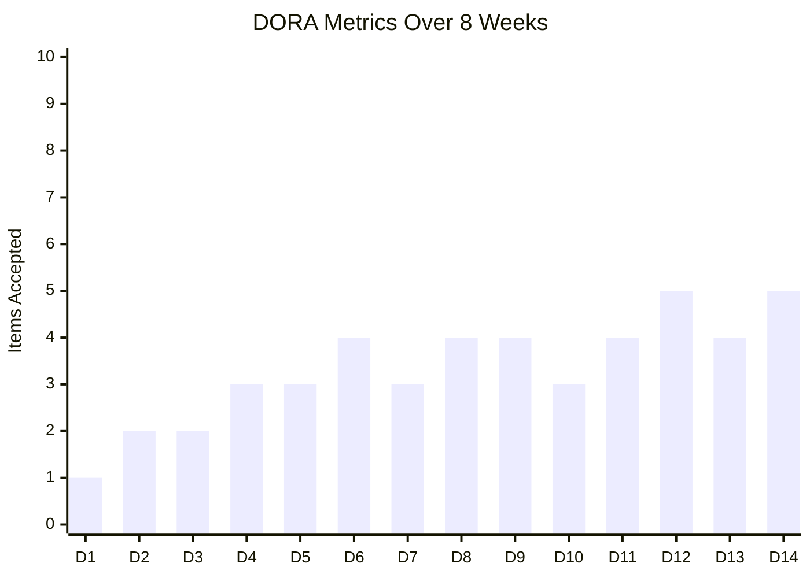

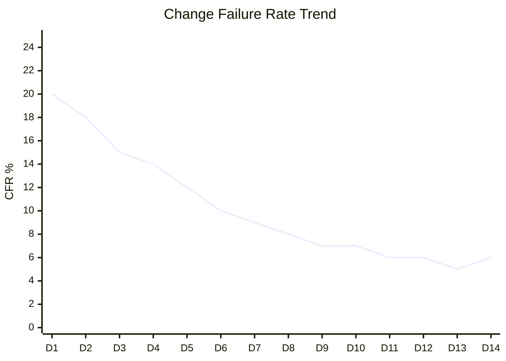

The CFR trend shows the fleet improving from 20% (early Crawl) to 6% (ready for Run). This is the signature of a learning fleet -- structured feedback loops compound over time.

#### Interpreting Flow Quality

**First-Pass Yield** measures handoff quality per boundary pair. The `e2e-test-engineer → product-owner` boundary at 85% is the weakest link -- the retro should investigate why test handoffs get rejected more than others.

**Rework Cycles** (0.3/item) means most items pass on the first attempt. Values above 1.0 indicate systemic review problems.

**Task Outcomes** show that 90% of promoted items complete successfully (4% abandoned, 6% restarted). High abandonment suggests grooming quality issues; high restart rate suggests poor initial approach choices.

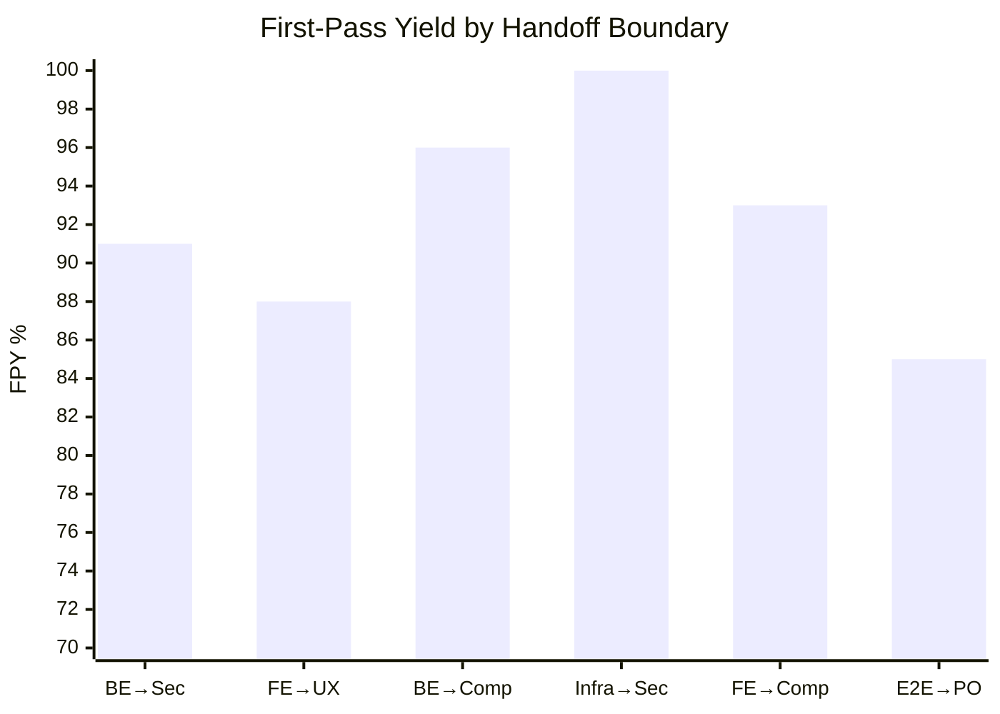

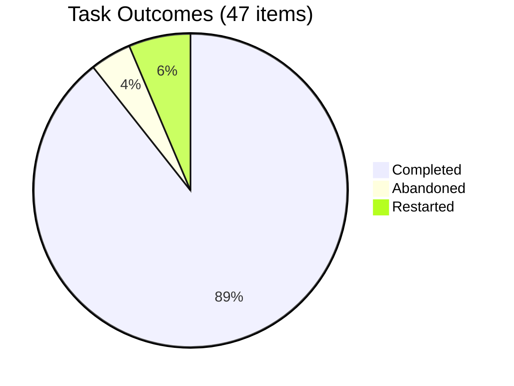

### `ops/dora.sh --sm` _(simulated)_

```
================================================================
                 PACE RECOMMENDATION
================================================================

  PACE RECOMMENDATION
    Current pace: Walk

  DORA signals
    CFR: 6% (Walk threshold: <=10%)

  Flow signals
    FPY: 91%

  Recommendation: Advance to Run
```

### `ops/dora.sh --cost` _(simulated)_

```
================================================================
                 AGENT COST ANALYSIS
================================================================

  SUMMARY
    Total invocations: 312
    Total tokens:      5,841,700

  MODEL SPLIT
    opus: 89 calls, 2,847,400 tokens
    sonnet: 198 calls, 2,815,200 tokens
    haiku: 25 calls, 179,100 tokens
```

#### Interpreting Cost Analysis

The **model split** shows how token budget is distributed across model tiers. This fleet uses Opus for 29% of calls but 49% of tokens -- expected since judgment-heavy tasks (grooming, review, architecture) use Opus and consume more tokens per call. Sonnet handles 63% of calls efficiently. Haiku is used sparingly for routine checks.

The CFO evaluates whether this split is appropriate for the current pace. At Crawl pace, higher Opus usage is expected (more judgment needed). At Fly pace, Opus should be under 40% of dispatches.

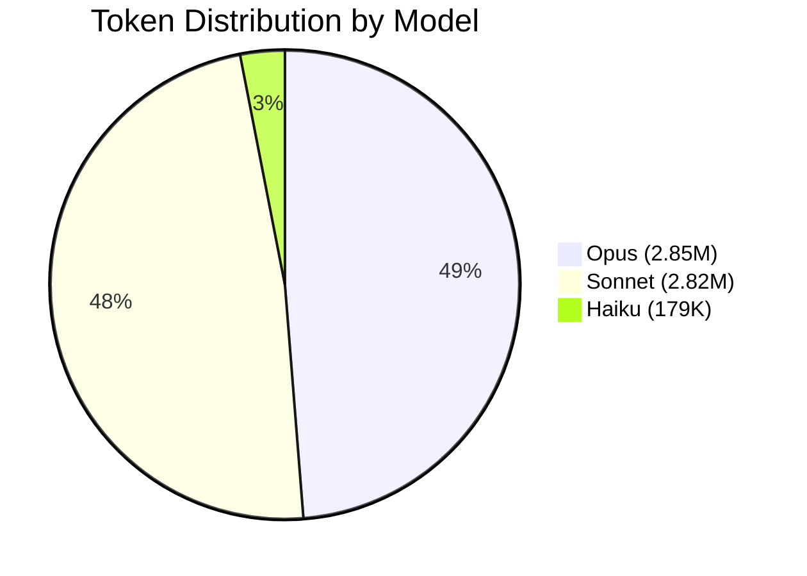

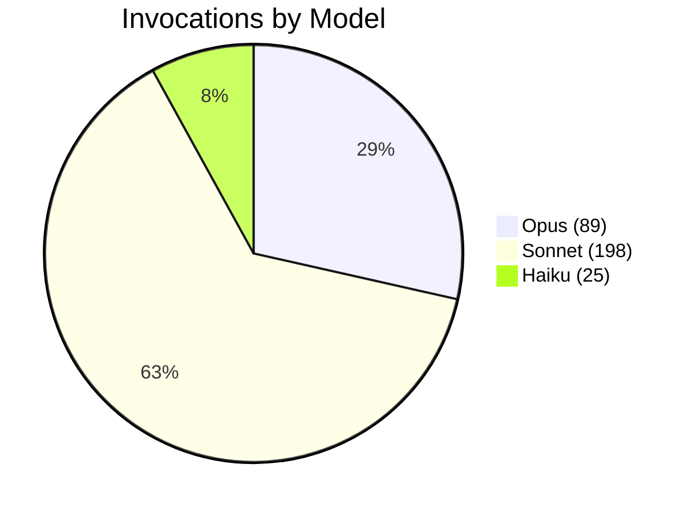

### `ops/dora.sh --item 42` _(simulated)_

```
================================================================
                   ITEM DETAIL: 42
================================================================

  LIFECYCLE
    Promoted:  2026-03-10T14:22:00Z
    Accepted:  2026-03-11T09:45:00Z
    Lead time: 1.35 sessions (19380s)

  BUGS: 1 found
    [high] Input validation bypass in auth flow — fixed in 0.12 sessions

  HANDOFF REJECTIONS: 1
    security-reviewer rejected backend-specialist (missing CSRF token)
```

### `ops/pathways.sh` _(simulated)_

```
╔══════════════════════════════════════════════════════════════╗
║              COMMUNICATION PATHWAYS                        ║
╚══════════════════════════════════════════════════════════════╝

  ACTUAL PATHWAYS (inferred from handoff-sent events)

  From                           To                           Count
  ----                           --                           -----
  backend-specialist             security-reviewer            42
  frontend-specialist            ux-reviewer                  35
  backend-specialist             compliance-auditor           28
  frontend-specialist            compliance-auditor           22
  infra-specialist               security-reviewer            18
  e2e-test-engineer              product-owner                15
  backend-specialist             frontend-specialist          8

  DECLARED vs ACTUAL ANALYSIS

  Declared pathways matched:     6 of 6 build pathways
                                 2 of 2 review pathways
                                 3 of 3 escalation pathways
                                 7 of 8 governance pathways

  Undeclared pathways found:     1
    backend-specialist -> frontend-specialist  (8 occurrences)
    Assessment: likely cross-domain coordination (API contract changes).
                Consider declaring if this is an expected pattern.

  FLEET DENSITY
    Active agents in handoffs: 7
    Unique communication paths: 7
    Density: 17% of possible paths (7/42)

  TOP COMMUNICATORS

  Agent                          Sent       Received   Total
  -----                          ----       --------   -----
  backend-specialist             78         0          78
  security-reviewer              0          60         60
  frontend-specialist            57         8          65
  compliance-auditor             0          50         50
  ux-reviewer                    0          35         35
  e2e-test-engineer              15         0          15
  infra-specialist               18         0          18
  product-owner                  0          15         15
```

#### Interpreting Pathway Analysis

**Handoff volume** shows which communication channels are most active. The backend-specialist dominates because it has the most review boundaries (security + compliance). An undeclared path (`backend → frontend`, 8x) signals cross-domain coordination that should be evaluated.

**Fleet density** at 17% is healthy -- agents communicate through structured channels without excessive coordination overhead. See the [Pathway Analysis Guide](PATHWAY-ANALYSIS.md) for detailed interpretation guidance.

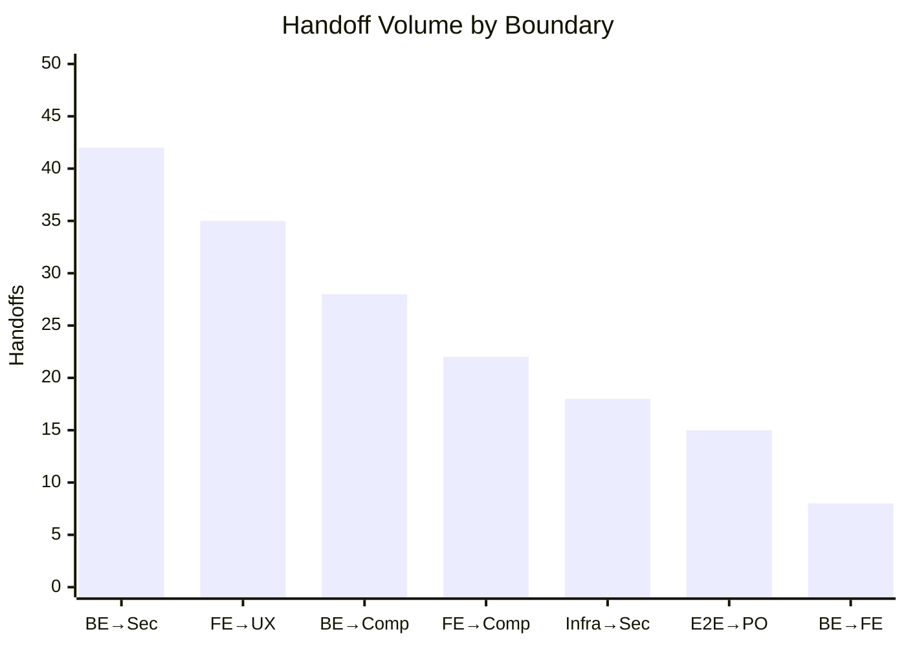

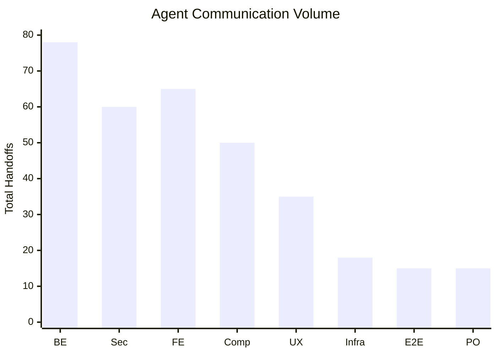

## Observing Agent Adaptation

The most valuable use of metrics is not measuring what happened — it is observing agents **changing their behavior** over time. The structured learning loop (findings → curation → refinement → distribution) compounds, and the metrics show you where and how.

### Example 1: Backend Specialist Learns Input Validation _(simulated)_

In days 1-5, the security-reviewer repeatedly rejected the backend-specialist's handoffs for missing input validation. The FPY for this boundary was 72%.

After the retro on day 5, the SM distributed a finding: "backend-specialist should validate all user input before handoff." The knowledge-ops agent wrote this to the backend-specialist's memory.

From day 6 onward, the same boundary's FPY rose to 96%. The backend-specialist stopped making the same mistake — not because it was told to in each task, but because the learning was embedded in its memory.

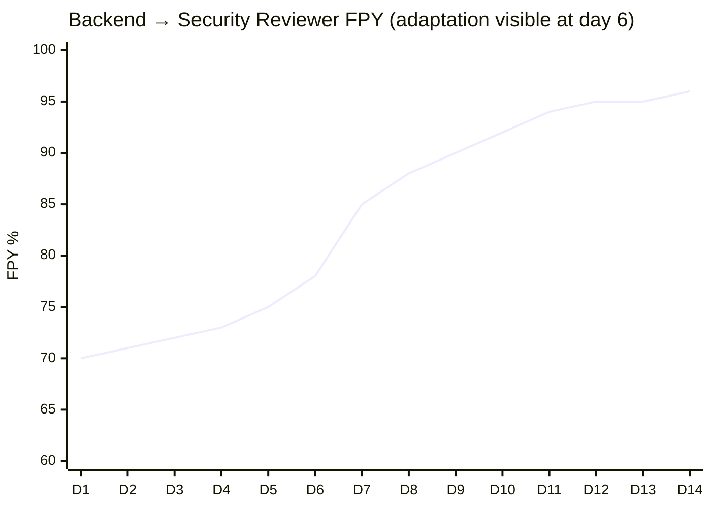

**What the human sees:** A clear inflection point at day 6 — the retro finding landed. If the FPY had not improved, the next retro would flag that the refinement didn't work and propose a different approach.

### Example 2: Fleet Learns to Estimate Better _(simulated)_

In the first few days, 15% of promoted items were abandoned or restarted — the fleet was over-committing to items that turned out larger or less valuable than expected. The grooming phase wasn't catching these issues.

After repeated findings, the PO refined its grooming process: tighter acceptance criteria, better WSJF calibration, and a "re-evaluate at build start" gate (Phase 3). The task outcome metrics show the improvement:

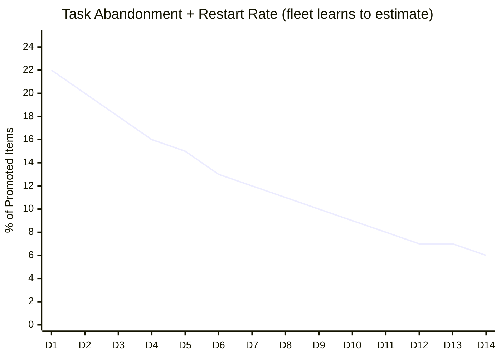

**What the human sees:** The fleet is wasting less effort over time. Items that get promoted are more likely to complete. This is the PO learning to groom better — a behavioral change driven by metrics feedback.

### Example 3: Cost Efficiency Improves with Pace _(simulated)_

As the fleet progresses from Crawl to Walk, agent cost per item should decrease — agents need less guidance, make fewer mistakes, and use cheaper models for routine tasks. The CFO monitors this:

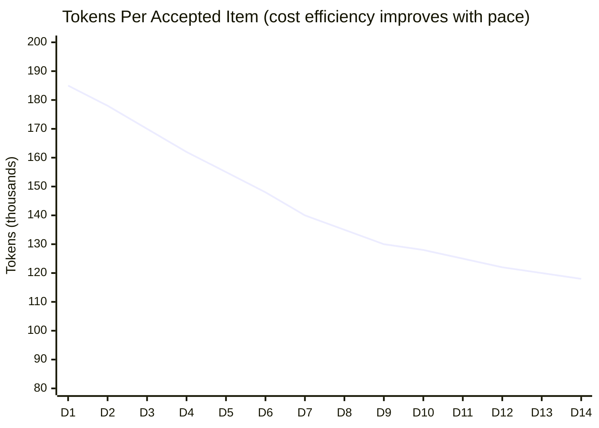

**What the human sees:** Early items cost ~185K tokens each (Crawl pace — lots of judgment calls, context enrichment, rework). By day 14, items cost ~118K tokens (Walk pace — agents have learned the patterns). The fleet is delivering more value per token.

### Example 4: Rework Cycles Decrease After Refinement _(simulated)_

The rework cycle metric (average fix passes before acceptance) shows whether review feedback is getting cleaner:

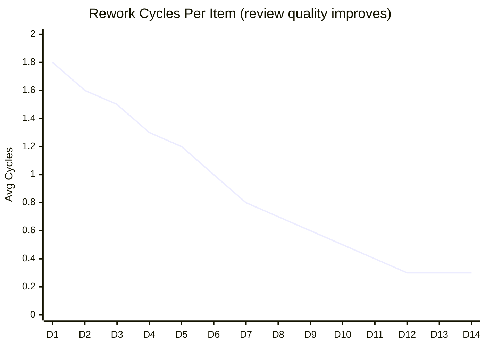

**What the human sees:** Items are passing review with fewer rounds of feedback. This means both builders (writing better code) and reviewers (giving clearer feedback) are adapting their behavior. By day 12-14, most items pass on the first attempt.

### Example 5: Fleet Responds to a Regression _(simulated)_

On day 8, a deployment introduced a regression — an authentication bypass that the security-reviewer missed during review. The CFR spiked from 5% to 12%, crossing back above the Walk threshold.

The fleet's response is visible in the metrics:

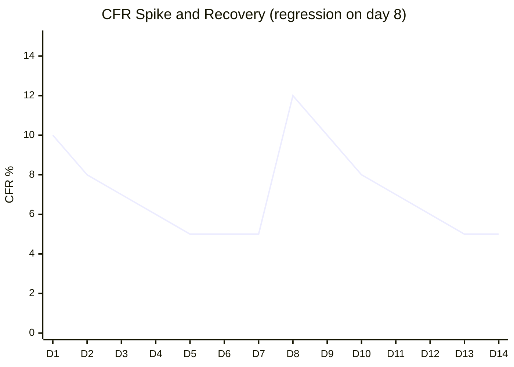

**What happened:**

1. **Day 8:** Regression detected in test environment. `bug-found --severity critical --source regression` logged. MTTR clock starts.
2. **Day 8:** RCA in test (read-only). Issue reproduced in dev. Backend-specialist (original author) fixes on the branch. MTTR: 0.15 sessions.
3. **Day 9:** SM triggers an exception-driven knowledge distribution. The CKO directs knowledge-ops to distribute the learning: "authentication changes require explicit security-reviewer dispatch with auth-specific scope."
4. **Day 9:** Security-reviewer's memory updated with the specific pattern to watch for. PO updates review dispatch criteria to always include security-reviewer for auth-touching changes.
5. **Days 10-14:** CFR recovers to 5%. The same type of regression does not recur.

**What the human sees:** A spike, a fast recovery, and a learning loop that prevents recurrence. The SM recommended remaining at Walk pace (not demoting to Crawl) because the recovery was fast and the root cause was addressed — one incident with a clear fix is not a systemic problem.

### Example 6: Fleet Detects and Resolves a Bottleneck _(simulated)_

Around day 6, the pathway analysis reveals that the backend-specialist's handoff volume is growing disproportionately — it's on every critical path:

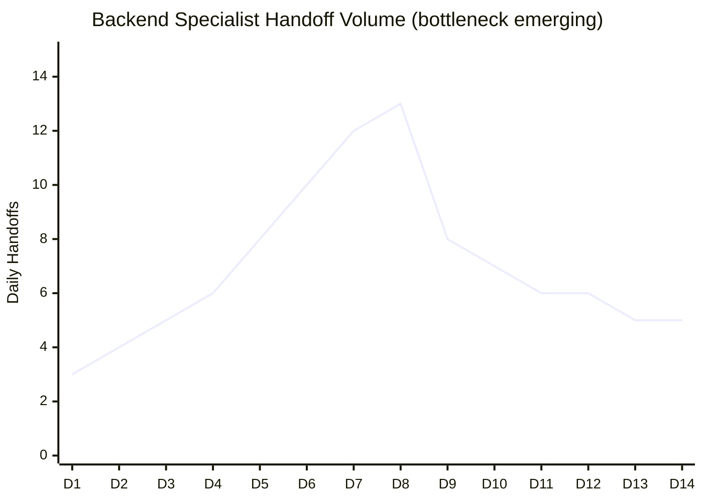

**What happened:**

1. **Day 6:** SM flags in the retro that the backend-specialist is handling 70% of all handoffs. Lead time for backend items is rising.
2. **Day 7:** COO reviews agent performance data. Recommends splitting the backend domain: one specialist for API/auth, another for data pipeline work.
3. **Day 8:** User approves. PO creates the new specialist agent (`api-specialist`). The CTO publishes technology guidance for the domain split.
4. **Days 9-14:** Handoff volume normalizes. The original backend-specialist handles data pipeline work; the new api-specialist handles API/auth. Lead time drops.

**What the human sees:** The fleet detected its own bottleneck through metrics, the COO recommended a structural change, and the change was implemented within a day. The metrics confirm the fix worked — handoff volume is balanced and lead time recovered.

### What to Look For

When reviewing metrics for adaptation signals:

| Signal          | Healthy Adaptation                 | Stalled Adaptation                                 |
| --------------- | ---------------------------------- | -------------------------------------------------- |
| FPY by boundary | Rising trend after retro findings  | Flat or declining after findings were distributed  |
| Task outcomes   | Abandonment/restart rate declining | Persistent high rate despite grooming refinements  |
| Cost per item   | Declining as pace increases        | Flat or rising — agents aren't learning efficiency |
| Rework cycles   | Declining over time                | Persistent high rework despite review refinements  |
| CFR             | Declining toward pace thresholds   | Oscillating without a clear downward trend         |

**If adaptation stalls**, the retro should ask: Did the learning land in the right agent's memory? Was the refinement specific enough? Does the agent need retraining (COO assessment)? Is the finding recurrent because the root cause wasn't addressed?

## Extending with Custom Metrics

### Adding a New Event Type

To add a custom event type to `ops/metrics-log.sh`:

**1. Add the variable initialization** (around the top of the argument parsing section):

```bash
MY_CUSTOM_FIELD=""
```

**2. Add flag parsing** (in the `case "$1" in` block):

```bash
    --my-field) MY_CUSTOM_FIELD="$2"; shift 2 ;;
```

**3. Add the event handler** (before the `*)` catch-all in the event type `case` block):

```bash
  my-custom-event)
    emit_event "$(jq -cn --arg ts "$TS" --arg event "$EVENT_TYPE" \
       --arg myField "$MY_CUSTOM_FIELD" --arg item "$ITEM" --arg agent "$AGENT" \
       '{"ts":$ts,"event":$event,"myField":$myField,"item":$item,"agent":$agent}')"
    ;;
```

**4. Add to the valid types error message:**

```bash
    echo "             my-custom-event" >&2
```

**5. Log the event from your agent or skill:**

```bash
ops/metrics-log.sh my-custom-event 42 --my-field "value"
```

### Adding a Custom Dashboard Section

To add a custom section to `ops/dora.sh`:

**1. Define a function** (following the existing pattern):

```bash
my_custom_metrics() {
  local events
  events=$(filtered_events)

  echo "================================================================"
  echo "                 MY CUSTOM METRICS                              "
  echo "================================================================"
  echo ""

  local my_count=0
  if [[ -n "$events" ]]; then
    my_count=$(echo "$events" | jq -c 'select(.event == "my-custom-event")' | grep -c . || true)
  fi

  echo "  MY METRIC"
  echo "    count: $my_count"
  echo ""
}
```

**2. Add it to the main dispatch** (in the `case "$MODE" in` block):

```bash
  my-metrics) my_custom_metrics ;;
```

**3. Add a CLI flag** (in the flag parsing):

```bash
    --my-metrics) MODE="my-metrics"; shift ;;
```

### Configuring the Backend

The metrics backend is configured in `fleet-config.json`:

```json
"metrics": {
  "backend": "jsonl",
  "file": ".claude/metrics/events.jsonl",
  "webhook": null,
  "statsd": null,
  "opentelemetry": null
}
```

| Backend         | Status    | How It Works                                                  |
| --------------- | --------- | ------------------------------------------------------------- |
| `jsonl`         | Default   | Append-only JSON lines to the configured file                 |
| `webhook`       | Supported | POST each event to the configured URL (also persists locally) |
| `statsd`        | Planned   | StatsD counter/timer dispatch                                 |
| `opentelemetry` | Planned   | OTEL span/metric export                                       |

All backends persist events locally to the JSONL file as a fallback. The dashboard tools (`ops/dora.sh`, `ops/pathways.sh`) always read from the local file.

### Custom Metrics Best Practices

- **Use `ops/metrics-log.sh` for all events.** Never write to `events.jsonl` directly. The script handles formatting, timestamps, backend dispatch, and validation.
- **Follow the naming convention.** Event names use kebab-case: `noun-verb` (e.g., `item-promoted`, `bug-found`, `compliance-applied`).
- **Include the agent identity.** Set `AGENT_NAME` env var or accept the default. This enables per-agent analysis.
- **Keep events atomic.** One event per action. Don't batch multiple actions into one event.
- **Use existing flags when possible.** `--item`, `--from`, `--to`, `--severity`, `--reason` are already parsed. Only add new flags for genuinely new fields.

## Metrics-Driven Decisions

The framework uses metrics to drive key decisions:

| Decision                        | Metrics Used                                    | Threshold                                              |
| ------------------------------- | ----------------------------------------------- | ------------------------------------------------------ |
| Pace promotion (Crawl → Walk)   | CFR                                             | ≤ 10%                                                  |
| Pace promotion (Walk → Run)     | CFR + FPY                                       | CFR ≤ 5%, FPY ≥ 80%                                    |
| Knowledge distribution cadence  | Fleet pace                                      | Crawl: every item, Walk: 2-3, Run: 3-5, Fly: on-demand |
| Agent retraining recommendation | FPY by agent, rework cycles, findings frequency | COO evaluates trends                                   |
| Cost optimization               | Model split, tokens per item                    | CFO interprets against budget                          |

All thresholds are configurable in `fleet-config.json` under the `pace` section.
