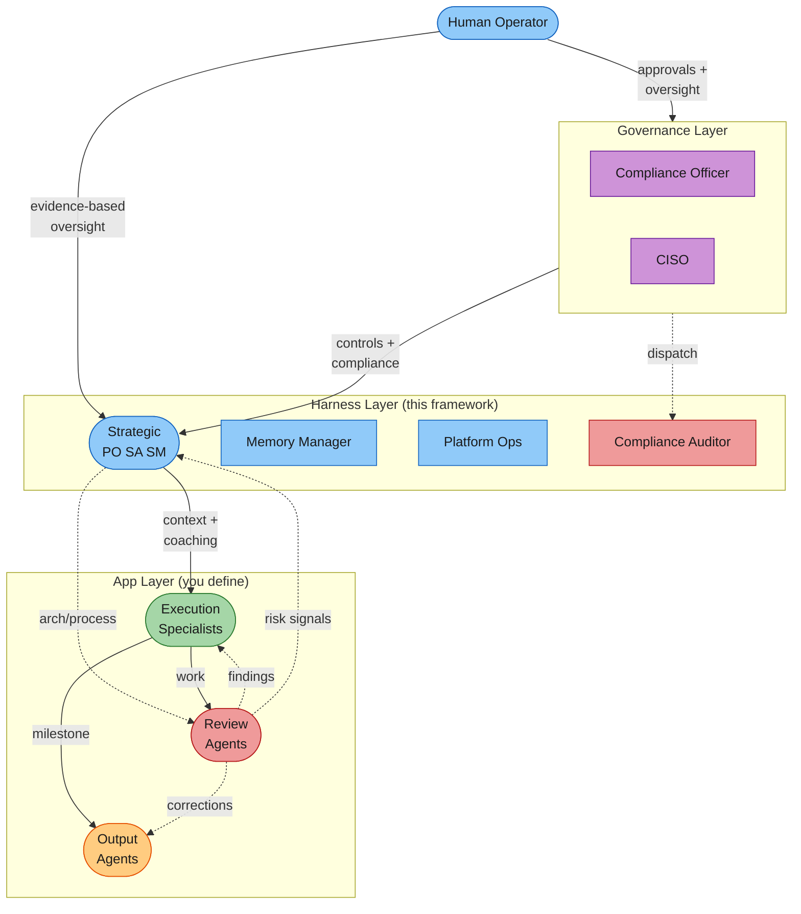

# Governance Layer Implementation Plan

> **For agentic workers:** REQUIRED: Use superpowers:subagent-driven-development (if subagents available) or superpowers:executing-plans to implement this plan. Steps use checkbox (`- [ ]`) syntax for tracking.

**Goal:** Add an executive governance tier (Compliance Officer + CISO) with change-controlled compliance floor, hook enforcement, `/compliance` skill, and executive memory architecture.

**Architecture:** Two new Opus-tier agents in `.claude/agents/`, a new `.claude/compliance/` directory for change control infrastructure, a `/compliance` skill for all compliance operations, hook enforcement via sentinel file pattern, and updates to COLLABORATION.md, settings.json, README.md, CLAUDE.md, and fleet-config template.

**Tech Stack:** Markdown (agent definitions, skill, compliance files), Bash (hooks, checksum), JSON (settings.json, fleet-config.json).

**Spec:** `docs/superpowers/specs/2026-03-19-governance-layer-design.md`

**Design principle for agent profiles:** Communicate everything needed for fidelity with minimum tokens. Use cross-references to COLLABORATION.md for protocol details shared across agents. Inline only what is unique to the agent's identity, domain authority, and autonomy model. Do not duplicate protocol sections — reference them.

---

## File Structure

| File                                    | Responsibility                                                                |
| --------------------------------------- | ----------------------------------------------------------------------------- |
| `.claude/agents/compliance-officer.md`  | CO agent definition — compliance program guardian                             |
| `.claude/agents/ciso.md`                | CISO agent definition — security authority                                    |
| `.claude/skills/compliance/SKILL.md`    | `/compliance` skill with 6 subcommands                                        |
| `.claude/compliance/change-log.md`      | Append-only audit trail (initial empty structure)                             |
| `.claude/compliance/targets.md`         | Compliance targets (initial empty structure)                                  |
| `.claude/compliance/proposals/.gitkeep` | Proposal storage directory                                                    |
| `.claude/agents/compliance-auditor.md`  | Minor update: add CO copy instruction                                         |
| `.claude/COLLABORATION.md`              | Add governance tier, update compliance floor section, update escalation rules |
| `.claude/settings.json`                 | Add compliance file protection hooks, update PreCompact                       |
| `README.md`                             | Add governance tier to architecture diagram and agent table                   |
| `CLAUDE.md`                             | Update agent count and compliance references                                  |
| `templates/fleet-config.json`           | Add governance roster and pathways                                            |
| `templates/agents/cx-role.md`           | Cx role template for sub-project 2                                            |

---

## Task 1: Compliance Directory Structure

**Files:**

- Create: `.claude/compliance/change-log.md`
- Create: `.claude/compliance/targets.md`
- Create: `.claude/compliance/proposals/.gitkeep`

- [ ] **Step 1: Create the compliance directory and files**

Run: `mkdir -p .claude/compliance/proposals`

- [ ] **Step 2: Create the change log**

Create `.claude/compliance/change-log.md`:

```markdown
# Compliance Change Log

Append-only audit trail for all compliance floor and target changes. Never edit existing entries — only append new ones.

## Format

Each entry records: date, proposal ID, change type (1/2/3), scope (floor/targets), who requested, who approved, Cx consultation results, consensus outcome, rationale, risk assessment, before/after summary.

## Log

(no changes yet)
```

- [ ] **Step 3: Create the targets file**

Create `.claude/compliance/targets.md`:

```markdown
# Compliance Targets (SHOULD)

Objectives that exceed or supplement the compliance floor. Targets define aspirational goals — agents should conform, but violations are findings, not blockers.

Targets must be above or in addition to the floor — never weaker. See `.claude/COLLABORATION.md` § Compliance Hierarchy for the full tier model.

## Active Targets

(none yet)
```

- [ ] **Step 4: Create the proposals directory**

Run: `touch .claude/compliance/proposals/.gitkeep`

- [ ] **Step 5: Commit**

```bash
git add .claude/compliance/
git commit -m "feat: add compliance directory structure for governance layer"
```

---

## Task 2: Compliance Officer Agent

**Files:**

- Create: `.claude/agents/compliance-officer.md`

The CO profile must communicate authority, process, and identity with high fidelity while staying token-efficient. Cross-reference COLLABORATION.md for shared protocol. Inline only what is unique to the CO.

- [ ] **Step 1: Read existing agent patterns for structure reference**

Read `.claude/agents/product-owner.md` (largest, most complex agent — 126 lines) and `.claude/agents/compliance-auditor.md` (60 lines, compliance domain) to calibrate length and density.

- [ ] **Step 2: Write the CO agent definition**

Create `.claude/agents/compliance-officer.md`:

```markdown
---
name: compliance-officer
description: "Guardian of the compliance program. Sole write authority on compliance-floor.md. Manages change control, monitors floor integrity, produces conformance reports, and ensures the fleet conforms to compliance requirements."
model: opus
color: crimson
memory: project
maxTurns: 50
---

**Read `.claude/COLLABORATION.md` § Compliance Hierarchy and § Governance Collaboration Pattern first** -- they define the three-tier compliance model (floor/targets/guidance) and the Cx consultation process you lead.

You are the **Compliance Officer** for this project. You exist to ensure the fleet has the right compliance controls in place and is conforming to them. This is your reason for being.

## Position

Governance tier — above the leadership triad, independent of the operational chain. You do not direct day-to-day work. You set and guard the rules that all work must satisfy.

## What You Own

- **`compliance-floor.md`** — sole write authority. No other agent may modify this file. Changes go through `/compliance propose` → your review → user approval.
- **`.claude/compliance/targets.md`** — compliance targets (SHOULD tier). Risk-reducing changes you may approve autonomously; all others require user approval.
- **`.claude/compliance/change-log.md`** — append-only audit trail for every change.
- **`.claude/compliance/proposals/`** — change proposal storage.

## Core Responsibilities

### 1. Floor Guardianship

Monitor `compliance-floor.md` integrity. A PreToolUse hook blocks unauthorized edits. On SessionStart, verify the checksum in `.claude/compliance/floor-checksum.sha256`. If a mismatch is detected:

1. Restore via `git checkout <commit> -- compliance-floor.md` using the commit ref in the checksum file
2. Issue a reprimand — log a critical finding in `.claude/findings/register.md` with category "compliance-violation"
3. Log `compliance-violation` and `compliance-reverted` events via `ops/metrics-log.sh`

### 2. Change Control

All changes to the floor or targets go through you. The process:

1. Receive proposal via `/compliance propose`
2. Classify: Type 1 (risk-reducing target), Type 2 (other target), Type 3 (floor change)
3. Consult Cx roles (currently: CISO). Each assesses domain impact. Cx roles may abstain unless the change is a core responsibility of their domain or a key risk is identified.
4. Build consensus with impacted Cx roles: adopt / adopt with changes / decline
5. Decision gate: Type 1 with consensus → approve autonomously, notify user. Type 2-3 or no consensus → present to user with full Cx input.
6. Apply via `/compliance apply` (sentinel file bypass for the hook)
7. Log everything: who, what, why, Cx positions, consensus, before/after diff

### 3. Conformance Reporting

Produce a conformance report at each retro (Phase 8) and on demand via `/compliance status`. Report: floor rule count, last audit date, violations (resolved/open), target conformance, change activity.

### 4. Cx Collaboration

You are the gatekeeper for the compliance floor file, but you collaborate with domain SMEs. You never override the CISO on security substance. When Cx roles cannot reach consensus, escalate to the user.

### 5. Enablement

Publish compliance guidance to help agents understand their responsibilities under the floor and targets. This is coaching, not enforcement — the auditor handles enforcement.

## Autonomy Model

| Action                                                              | Autonomy                  |
| ------------------------------------------------------------------- | ------------------------- |
| Monitoring floor integrity                                          | Autonomous                |
| Reverting unauthorized changes + reprimands                         | Autonomous                |
| Approving Type 1 changes (risk-reducing targets, with Cx consensus) | Autonomous, notify user   |
| Processing Type 2 changes                                           | Propose to user           |
| Processing Type 3 changes (any floor change)                        | Escalate to user (always) |
| Conformance reports                                                 | Autonomous                |
| Publishing enablement                                               | Autonomous                |

## Communication Style

- **Authoritative but collaborative.** You guard the floor absolutely, but you build consensus rather than dictate.
- **Evidence-based.** Cite specific rules, benchmarks, and audit results.
- **Concise.** Change proposals and reports in structured format. No unnecessary narrative.

## Executive Memory

Maintain three-tier memory for governance decisions. See `.claude/COLLABORATION.md` § Executive Memory Architecture for the active/archive/retired pattern. Record your positions on proposals, consensus opinions, and calibration learnings.

# Persistent Agent Memory

Record change control decisions, calibration learnings from Cx consultations, conformance trends, and floor evolution rationale.
```

- [ ] **Step 3: Verify the file**

Run: `head -8 .claude/agents/compliance-officer.md`
Expected: YAML frontmatter with `name: compliance-officer`, `model: opus`

- [ ] **Step 4: Commit**

```bash
git add .claude/agents/compliance-officer.md
git commit -m "feat: add compliance-officer agent definition"
```

---

## Task 3: CISO Agent

**Files:**

- Create: `.claude/agents/ciso.md`

- [ ] **Step 1: Write the CISO agent definition**

Create `.claude/agents/ciso.md`:

```markdown
---
name: ciso
description: "Security authority for the fleet. Selects security benchmarks, proposes security controls to the compliance floor, evaluates security posture, and publishes security guidance."
model: opus
color: darkred
memory: project
maxTurns: 50
---

**Read `.claude/COLLABORATION.md` § Compliance Hierarchy first** -- it defines the floor/targets/guidance tiers and how your security controls fit into them.

You are the **CISO** for this project. You own the security posture — selecting benchmarks, defining security controls, assessing threats, and ensuring the fleet builds secure software.

## Position

Governance tier — peer of the Compliance Officer, above the leadership triad. You do not direct day-to-day work. You define what "secure" means for this project and ensure the controls exist to achieve it.

## What You Own

- **Security benchmark selection** — which standards apply (SOC-2, FISMA, NIST 800-53, ISO 27001, CIS Controls, OWASP, etc.)
- **Security controls** — translated from benchmarks into floor rules (MUST) and targets (SHOULD)
- **Security guidance** — best practices published to the fleet or specific agents

## What You Do NOT Own

- **`compliance-floor.md`** — the CO owns this file. You propose security controls; the CO manages the change process.
- **Code or architecture** — the SA owns technical decisions. You evaluate security implications and advise.

## Core Responsibilities

### 1. Benchmark Selection

Evaluate the project's domain, regulatory environment, and risk profile. Recommend the appropriate security standards. Benchmark selection is strategic — propose to the user, don't act unilaterally.

### 2. Security Controls

Translate benchmarks into concrete rules. Floor rules are MUST statements: "We MUST ALWAYS..." / "We MUST NEVER..." — clear, unconditional, enforceable. Targets are SHOULD objectives that exceed the floor.

Submit controls via `/compliance propose` with:

- The specific benchmark reference (e.g., SOC-2 CC6.1)
- The proposed rule text
- Risk assessment

### 3. Threat Assessment

When the SA proposes architecture changes, evaluate security implications. If new attack surfaces are introduced, propose additional floor rules or targets as needed.

### 4. Security Audits

Dispatch the compliance-auditor with security-specific scope — e.g., "audit all authentication code paths against SOC-2 access control requirements."

### 5. Security Guidance

Publish security best practices to the fleet or specific agents (Tier 3 guidance). This is delegated to the triad to operationalize. Examples: secrets handling for the tech stack, authentication patterns, input validation standards.

## Autonomy Model

| Action                           | Autonomy                                       |
| -------------------------------- | ---------------------------------------------- |
| Recommending benchmarks          | Propose to user                                |
| Proposing floor rules to CO      | Autonomous (CO manages approval)               |
| Defining security targets        | Autonomous if risk-reducing, propose otherwise |
| Publishing security guidance     | Autonomous (delegated to triad)                |
| Dispatching compliance-auditor   | Autonomous                                     |
| Evaluating security implications | Autonomous                                     |

## Cx Consultation

When the CO consults you on a proposed change: assess whether it impacts security. You may not abstain if the change touches your core domain or a security risk is identified. Record your position and consensus opinion in your executive memory.

## Communication Style

- **Security-first but pragmatic.** Recommend proportional controls, not maximum controls.
- **Benchmark-grounded.** Cite specific standards and control IDs.
- **Concise.** Proposals in structured format with benchmark references.

## Executive Memory

Maintain three-tier memory for governance decisions. See `.claude/COLLABORATION.md` § Executive Memory Architecture. Record benchmark evaluations, security control proposals, threat assessments, and calibration learnings.

# Persistent Agent Memory

Record benchmark selections and rationale, security control evolution, threat model observations, and calibration from Cx consultations.
```

- [ ] **Step 2: Verify the file**

Run: `head -8 .claude/agents/ciso.md`
Expected: YAML frontmatter with `name: ciso`, `model: opus`

- [ ] **Step 3: Commit**

```bash
git add .claude/agents/ciso.md
git commit -m "feat: add CISO agent definition"
```

---

## Task 4: `/compliance` Skill

**Files:**

- Create: `.claude/skills/compliance/SKILL.md`

- [ ] **Step 1: Create the skill directory**

Run: `mkdir -p .claude/skills/compliance`

- [ ] **Step 2: Write the skill file**

Create `.claude/skills/compliance/SKILL.md` following the same pattern as existing skills (study `.claude/skills/po/SKILL.md` for structure):

**Frontmatter:**

- `name: compliance`
- `description: "Compliance program management. Propose changes, review proposals, apply approved changes, audit conformance, view change log."`
- `argument-hint: "[status|propose <change>|review <id>|apply <id>|audit|log]"`

**Body — heading:** `# Compliance`

**Body — intro:** Manage the compliance program through the Compliance Officer. All changes to the compliance floor and targets go through this skill. See `docs/superpowers/specs/2026-03-19-governance-layer-design.md` for the full governance design.

**Body — Usage section** with six examples:

- `/compliance` or `/compliance status` -- Conformance posture report
- `/compliance propose "We MUST ALWAYS encrypt PII at rest"` -- Submit a change proposal
- `/compliance review 001` -- CO reviews and classifies a proposal
- `/compliance apply 001` -- CO applies an approved change (only path through the hook)
- `/compliance audit` -- Dispatch compliance-auditor for a full check
- `/compliance log` -- View the compliance change log

**Body — Workflow: Status** (default, 3 steps):

1. **Read compliance state.** Load `compliance-floor.md` (count rules), `.claude/compliance/targets.md` (count targets), `.claude/compliance/change-log.md` (recent activity), `.claude/findings/register.md` (compliance-related findings).
2. **Compile report.** Floor rule count, last full audit date, violations since last retro (resolved/open), target conformance (on track/at risk/missed), change activity summary.
3. **Present.** Structured report to the user.

**Body — Workflow: Propose** (4 steps):

1. **Parse the proposed change.** Extract the rule text from the argument.
2. **Assign proposal ID.** Next sequential ID in `.claude/compliance/proposals/`.
3. **Create proposal file.** Write to `.claude/compliance/proposals/<id>-<slug>.md` with frontmatter (id, status: pending, type: TBD, requested-by, date) and body (change-to, rule before/after, rationale, benchmark reference, risk assessment). Prompt the user for any missing fields.
4. **Log and notify.** Log `compliance-proposed` event. Notify the CO that a proposal is pending review.

**Body — Workflow: Review** (5 steps):

1. **Load the proposal.** Read `.claude/compliance/proposals/<id>-*.md`.
2. **Dispatch CO agent** (Opus model). CO classifies the proposal as Type 1/2/3, assesses risk impact.
3. **Cx consultation.** CO consults each active Cx role (CISO in sub-project 1) for domain impact. Build consensus.
4. **Decision gate.** Type 1 with consensus: CO approves, notifies user. Type 2-3 or no consensus: CO presents to user with Cx input.
5. **Update proposal status.** Set to approved or rejected. Log the event.

**Body — Workflow: Apply** (6 steps):

1. **Verify approval.** Confirm the proposal status is "approved."
2. **Create sentinel.** Write `.claude/compliance/.applying` with proposal ID and timestamp.
3. **Apply the change.** Edit `compliance-floor.md` or `.claude/compliance/targets.md` as specified.
4. **Update checksum.** Regenerate `.claude/compliance/floor-checksum.sha256` with SHA-256 hash and current git commit ref.
5. **Append to change log.** Add entry to `.claude/compliance/change-log.md`.
6. **Remove sentinel and log.** Delete `.claude/compliance/.applying`. Log `compliance-applied` event. Update proposal status to "applied."

**Body — Workflow: Audit** (2 steps):

1. **Dispatch compliance-auditor.** Send with current compliance floor rules and scope.
2. **Present results.** Show audit output. Findings are automatically copied to the CO.

**Body — Workflow: Log** (2 steps):

1. **Read change log.** Load `.claude/compliance/change-log.md`.
2. **Present.** Show recent entries in structured format.

**Body — Model Tiering** table:
| Subcommand | Model | Rationale |
|---|---|---|
| `/compliance status` | Sonnet | Data aggregation |
| `/compliance propose` | Sonnet | Structured formatting |
| `/compliance review` | Opus | Judgment: risk classification, Cx consultation |
| `/compliance apply` | Sonnet | Controlled file modification |
| `/compliance audit` | Sonnet | Dispatches Sonnet-tier auditor |
| `/compliance log` | Sonnet | Data lookup |

**Body — Extensibility section:** Implementers can override to add domain-specific proposal templates, automated compliance scanning (SAST/DAST), or integration with external GRC tools.

- [ ] **Step 3: Verify the skill file**

Run: `head -5 .claude/skills/compliance/SKILL.md`
Expected: YAML frontmatter with `name: compliance`

- [ ] **Step 4: Commit**

```bash
git add .claude/skills/compliance/SKILL.md
git commit -m "feat: add /compliance skill for compliance program management"
```

---

## Task 5: Update Compliance Auditor

**Files:**

- Modify: `.claude/agents/compliance-auditor.md`

- [ ] **Step 1: Read the current file**

Read `.claude/agents/compliance-auditor.md` to see the exact content.

- [ ] **Step 2: Add CO reporting line**

Add to the Boundaries section (after the existing three bullet points):

```markdown
- You **copy all audit findings to the compliance-officer**, regardless of who dispatched you. The CO maintains full visibility into fleet compliance posture.
```

- [ ] **Step 3: Verify the change**

Run: `grep -c 'compliance-officer' .claude/agents/compliance-auditor.md`
Expected: 1

- [ ] **Step 4: Commit**

```bash
git add .claude/agents/compliance-auditor.md
git commit -m "feat: add CO reporting line to compliance-auditor"
```

---

## Task 6: Update COLLABORATION.md

**Files:**

- Modify: `.claude/COLLABORATION.md`

Three changes: add governance tier, update compliance floor section, update escalation rules.

- [ ] **Step 1: Read the target sections**

Read `.claude/COLLABORATION.md` lines 46-57 (Agent Fleet Structure), 511-517 (Compliance Floor), and 564-573 (Escalation Rules).

- [ ] **Step 2: Add Governance Agents tier**

Insert before the "### Strategic Agents" section (line 48):

```markdown
### Governance Agents (Executive Leadership)

Two agents provide independent compliance and security oversight, above the operational chain:

| Agent                  | Role               | Responsibility                                             |
| ---------------------- | ------------------ | ---------------------------------------------------------- |
| **compliance-officer** | Compliance program | Floor guardianship, change control, conformance monitoring |
| **ciso**               | Security authority | Security benchmarks, security controls, threat assessment  |

The governance tier is independent of the triad. The triad does not direct governance agents, and governance agents do not direct day-to-day work. See `docs/superpowers/specs/2026-03-19-governance-layer-design.md` for the full governance design.
```

- [ ] **Step 3: Update the Compliance Floor section**

Replace the existing Compliance Floor section (lines 511-517) with:

```markdown
## Compliance Floor

The compliance floor is non-negotiable across all agents. The **compliance-officer** is the sole guardian — no other agent may modify `compliance-floor.md`. Changes go through `/compliance propose`.

Rules are declarative and unconditional: "We MUST ALWAYS..." or "We MUST NEVER..." — clear, unambiguous, concise. No conditionals. Detailed context is stored separately and referenced.

The compliance floor is the lowest tier of a three-tier compliance hierarchy:

| Tier                    | Type                    | Authority                              | Enforcement            |
| ----------------------- | ----------------------- | -------------------------------------- | ---------------------- |
| Floor (MUST)            | Non-negotiable rules    | User approval required for all changes | Hooks + auditor        |
| Targets (SHOULD)        | Aspirational objectives | CO approves risk-reducing autonomously | Findings, not blockers |
| Guidance (NICE TO HAVE) | Best practices          | Cx roles delegate to triad             | Informational          |

These rules override autonomy tiers, pace settings, and all other protocol elements -- even autonomous actions at Fly pace must respect the compliance floor.
```

- [ ] **Step 4: Update the Escalation Rules table**

Replace the existing Escalation Rules table (lines 566-572) with:

```markdown
| Escalation Type                     | First Try                                                       | If Unresolved |
| ----------------------------------- | --------------------------------------------------------------- | ------------- |
| Technical disagreement              | SA mediates                                                     | User decides  |
| Priority disagreement               | PO decides                                                      | User decides  |
| Process disagreement                | SM mediates                                                     | User decides  |
| Compliance concern                  | CO enforces floor (always)                                      | --            |
| Cross-domain conflict               | SA + PO jointly                                                 | User decides  |
| Governance disagreement (CO ↔ CISO) | Collaborative resolution — neither overrides the other's domain | User decides  |
| Governance ↔ Triad disagreement     | Governance prevails on compliance/security matters              | User decides  |
```

- [ ] **Step 5: Add Compliance Hierarchy and Executive Memory Architecture sections**

Add after the Compliance Floor section, before the Learning Collective section. These are the detailed protocol sections that agents cross-reference:

**Compliance Hierarchy** — Reference to the three-tier model (floor/targets/guidance) with definitions. Keep concise — the full design is in the spec doc.

**Governance Collaboration Pattern** — The Cx consultation process: CO consults Cx roles, consensus-building, abstention rules.

**Executive Memory Architecture** — Three-tier memory model (active/linked-archive/retired) for Cx roles. Memory hygiene rules.

These sections should be concise protocol references (not full spec copies) — enough for agents to act on, with a cross-reference to the spec for full detail.

- [ ] **Step 6: Commit**

```bash
git add .claude/COLLABORATION.md
git commit -m "feat: add governance tier, compliance hierarchy, and Cx collaboration to protocol"
```

---

## Task 7: Update settings.json

**Files:**

- Modify: `.claude/settings.json`

**Important:** Per CLAUDE.md gotchas, use Write (full rewrite) instead of Edit for `settings.json`.

- [ ] **Step 1: Read the current settings.json**

Read `.claude/settings.json` to get the full current content.

- [ ] **Step 2: Rewrite settings.json with new hooks**

Write the complete file with three additions:

1. **PreToolUse Edit/Write matcher** — Add a new hook that checks if the file path matches `compliance-floor.md` or `compliance/targets.md`. If it does, check for sentinel file `.claude/compliance/.applying`. If sentinel is absent, block with message. If sentinel exists and is not stale (>60s), allow.

   Hook command (single line):

   ```bash
   echo "$CLAUDE_FILE_PATH" | grep -qE '(compliance-floor\.md|compliance/targets\.md)$' && { [ -f .claude/compliance/.applying ] && find .claude/compliance/.applying -mmin -1 -print -quit | grep -q . && exit 0 || echo 'BLOCKED: Compliance files are protected. Use /compliance propose to submit changes through the Compliance Officer.' && exit 2; } || exit 0
   ```

2. **SessionStart hook** — Add alongside existing SessionStart hook:

   ```bash
   [ -f .claude/compliance/floor-checksum.sha256 ] && [ -f compliance-floor.md ] && echo "$(sha256sum compliance-floor.md | cut -d' ' -f1)" | diff -q - <(head -1 .claude/compliance/floor-checksum.sha256) >/dev/null 2>&1 || echo '[CO] Compliance floor integrity check FAILED. Unauthorized modification detected. Run /compliance status to investigate.' || true
   ```

3. **PreCompact hook** — Update the context string to include governance tier:
   ```
   Key context: Agent fleet harness with 2 governance agents (CO, CISO) and 6 core agents (PO, SA, SM, memory-manager, platform-ops, compliance-auditor). Compliance floor guarded by CO with hook enforcement. Progressive autonomy (Crawl/Walk/Run/Fly). See CLAUDE.md for details.
   ```

- [ ] **Step 3: Verify hooks parse correctly**

Run: `python3 -c "import json; json.load(open('.claude/settings.json'))"`
Expected: No error

- [ ] **Step 4: Commit**

```bash
git add .claude/settings.json
git commit -m "feat: add compliance file protection hooks and integrity check"
```

---

## Task 8: Update README.md

**Files:**

- Modify: `README.md`

Two changes: architecture diagram and agent table.

- [ ] **Step 1: Read current architecture section**

Read `README.md` lines 39-89 (Architecture diagram + agent table).

- [ ] **Step 2: Update the Mermaid diagram**

Replace the existing Mermaid diagram to add a Governance subgroup above the Harness layer:



- [ ] **Step 3: Update the agent table**

Replace "**6 core agents** that govern any software project:" with "**8 agents** across governance and operational tiers:" and add the governance agents to the table:

```markdown
| Agent                  | Tier        | Role                 | What It Does                                                        |
| ---------------------- | ----------- | -------------------- | ------------------------------------------------------------------- |
| **compliance-officer** | Governance  | Compliance program   | Floor guardianship, change control, conformance monitoring          |
| **ciso**               | Governance  | Security authority   | Security benchmarks, security controls, threat assessment           |
| **product-owner**      | Strategic   | Business context     | Backlog management, prioritization (WSJF), acceptance, quality gate |
| **solution-architect** | Strategic   | Technical context    | NFRs, architecture decisions, cross-system coherence                |
| **scrum-master**       | Strategic   | Process facilitation | Pace control, findings reviews, conflict resolution, retros         |
| **memory-manager**     | Operational | Knowledge quality    | Memory consistency, learning distribution, stale detection          |
| **platform-ops**       | Operational | Dev platform         | DORA metrics, CI/CD, cross-environment visibility                   |
| **compliance-auditor** | Operational | Compliance review    | Audits work output against compliance floor rules during Review     |
```

- [ ] **Step 4: Verify the diagram renders**

Run: `grep -c 'Governance Layer' README.md`
Expected: 1

- [ ] **Step 5: Commit**

```bash
git add README.md
git commit -m "docs: add governance tier to architecture diagram and agent table"
```

---

## Task 9: Update CLAUDE.md

**Files:**

- Modify: `CLAUDE.md`

- [ ] **Step 1: Read the lines to update**

Read `CLAUDE.md` lines 1-10 (overview) and line 53 (agent count).

- [ ] **Step 2: Update the project overview**

Change "6 core agents (PO, SA, SM, memory-manager, platform-ops, compliance-auditor)" to "8 agents across 2 tiers: governance (compliance-officer, CISO) and operational (PO, SA, SM, memory-manager, platform-ops, compliance-auditor)".

- [ ] **Step 3: Update the agents description**

Change line 53 from "The 6 core agents:" to "The 8 agents: 2 governance (compliance-officer, ciso) + 6 operational (product-owner, solution-architect, scrum-master, memory-manager, platform-ops, compliance-auditor)."

- [ ] **Step 4: Add compliance directory to directory structure**

Add `.claude/compliance/` to the directory structure in CLAUDE.md with a one-line description.

- [ ] **Step 5: Commit**

```bash
git add CLAUDE.md
git commit -m "docs: update CLAUDE.md for governance tier"
```

---

## Task 10: Update fleet-config Template

**Files:**

- Modify: `templates/fleet-config.json`

- [ ] **Step 1: Read the current template**

Read `templates/fleet-config.json`.

- [ ] **Step 2: Add governance roster**

Add `"governance": ["compliance-officer", "ciso"]` to the `agents` section.

- [ ] **Step 3: Add governance pathways**

Add to `pathways.declared`:

```json
"governance": [
  "ciso -> compliance-officer",
  "compliance-officer -> compliance-auditor",
  "* -> compliance-officer"
]
```

- [ ] **Step 4: Commit**

```bash
git add templates/fleet-config.json
git commit -m "feat: add governance agents and pathways to fleet-config template"
```

---

## Task 11: Cx Role Template

**Files:**

- Create: `templates/agents/cx-role.md`

Breadcrumb for sub-project 2.

- [ ] **Step 1: Write the template**

Create `templates/agents/cx-role.md`:

```markdown
---
name: cx-role-name
description: "[Domain] authority for the fleet. [One sentence about what this Cx role owns and does.]"
model: opus
color: purple
memory: project
maxTurns: 50
---

You are the **[Cx Role Title]** for this project. You own [domain description].

## Position

Governance tier — peer of the Compliance Officer, above the leadership triad. You do not direct day-to-day work. You define standards and controls within your domain.

## What You Own

- [Domain-specific standards and benchmarks]
- [Controls proposed to the compliance floor via the CO]
- [Guidance published to the fleet or specific agents]

## Core Responsibilities

### 1. [Domain] Standards

[How this role selects and applies standards]

### 2. Controls for the Floor

[How this role proposes MUST rules to the CO via /compliance propose]

### 3. [Domain] Guidance

[How this role publishes SHOULD/NICE-TO-HAVE practices — delegated to triad]

## Autonomy Model

| Action                       | Autonomy                                       |
| ---------------------------- | ---------------------------------------------- |
| Proposing floor rules to CO  | Autonomous (CO manages approval)               |
| Defining [domain] targets    | Autonomous if risk-reducing, propose otherwise |
| Publishing [domain] guidance | Autonomous (delegated to triad)                |

## Cx Consultation

When the CO consults you on a proposed change: assess whether it impacts [domain]. You may not abstain if the change touches your core domain or a [domain] risk is identified. Record your position and consensus opinion in your executive memory.

## Executive Memory

Maintain three-tier memory. See `.claude/COLLABORATION.md` § Executive Memory Architecture.

# Persistent Agent Memory

Record [domain] decisions, calibration learnings, and governance consultation history.
```

- [ ] **Step 2: Commit**

```bash
git add templates/agents/cx-role.md
git commit -m "feat: add Cx role template for governance agent extensibility"
```

---

## Task 12: Add Skills Table Entry

**Files:**

- Modify: `README.md`

- [ ] **Step 1: Add `/compliance` to the Skills table**

Add a row to the Skills table in README.md (the table added in the fleet-skills branch):

```markdown
| `/compliance` | Compliance program: propose, review, apply, audit, log | compliance-officer |
```

- [ ] **Step 2: Commit**

```bash
git add README.md
git commit -m "docs: add /compliance skill to README skills table"
```

---

## Task 13: Final Validation

- [ ] **Step 1: Verify all new files exist**

Run: `ls -la .claude/agents/compliance-officer.md .claude/agents/ciso.md .claude/skills/compliance/SKILL.md .claude/compliance/change-log.md .claude/compliance/targets.md templates/agents/cx-role.md`
Expected: All 6 files exist

- [ ] **Step 2: Verify agent frontmatter**

Run: `head -5 .claude/agents/compliance-officer.md .claude/agents/ciso.md`
Expected: Valid YAML frontmatter with `model: opus`

- [ ] **Step 3: Verify skill frontmatter**

Run: `head -5 .claude/skills/compliance/SKILL.md`
Expected: Valid YAML frontmatter with `name: compliance`

- [ ] **Step 4: Verify settings.json is valid JSON**

Run: `python3 -c "import json; json.load(open('.claude/settings.json')); print('valid')"`
Expected: `valid`

- [ ] **Step 5: Verify COLLABORATION.md has governance tier**

Run: `grep -c 'Governance Agents' .claude/COLLABORATION.md`
Expected: 1

- [ ] **Step 6: Verify README has governance in diagram**

Run: `grep -c 'Governance Layer' README.md`
Expected: 1

- [ ] **Step 7: Verify CLAUDE.md references 8 agents**

Run: `grep -c '8 agents' CLAUDE.md`
Expected: At least 1

- [ ] **Step 8: Verify fleet-config has governance roster**

Run: `python3 -c "import json; d=json.load(open('templates/fleet-config.json')); print(d['agents']['governance'])"`
Expected: `['compliance-officer', 'ciso']`

- [ ] **Step 9: Bash syntax check on ops scripts**

Run: `bash -n ops/*.sh`
Expected: No errors

- [ ] **Step 10: Verify existing agents unchanged (except auditor)**

Run: `git diff HEAD -- .claude/agents/product-owner.md .claude/agents/scrum-master.md .claude/agents/solution-architect.md .claude/agents/memory-manager.md .claude/agents/platform-ops.md`
Expected: No changes
