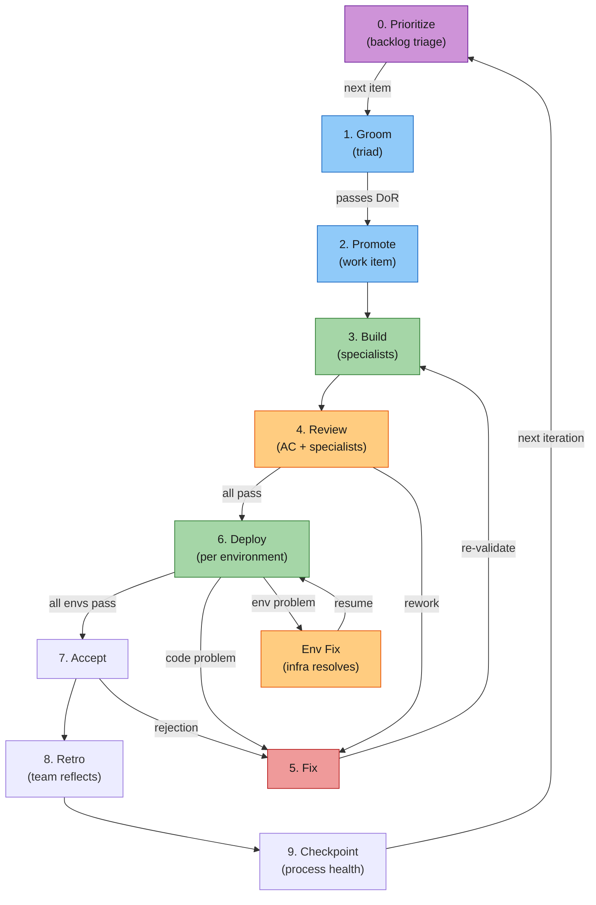

# Phase 0: Prioritize — Implementation Plan

> **For agentic workers:** REQUIRED: Use superpowers:subagent-driven-development (if subagents available) or superpowers:executing-plans to implement this plan. Steps use checkbox (`- [ ]`) syntax for tracking.

**Goal:** Add a configurable backlog triage step (Phase 0) to the work item lifecycle, including metrics event, skill updates, and documentation.

**Architecture:** Six independent changes: metrics event handler, fleet-config template, PO skill update, SessionStart hook, COLLABORATION.md lifecycle, and reference doc updates. Each produces a commit.

**Tech Stack:** Bash (metrics-log.sh), Markdown (docs), JSON (fleet-config, settings.json), Mermaid (diagram).

**Spec:** `docs/superpowers/specs/2026-03-22-phase0-prioritize-design.md`

---

### Task 1: Add `backlog-triaged` event to metrics-log.sh

**Files:**

- Modify: `ops/metrics-log.sh:39-44` (add arg vars)
- Modify: `ops/metrics-log.sh:319-331` (add event handler + update error message)

- [ ] **Step 1: Add arg variables for triage metrics**

In `ops/metrics-log.sh` at line 43, the line `TOPIC="" BY="" TRIGGER="" ACTION="" ITEMS=""` — add new vars to the end of the arg declarations block (line 44):

```bash
ITEMS_REVIEWED="" ITEMS_ADDED="" ITEMS_DROPPED="" ITEMS_REORDERED=""
```

- [ ] **Step 2: Add arg parsers**

In the `while` case block (around line 72-75), before the `*) POSITIONAL` line, add:

```bash
    --items-reviewed) ITEMS_REVIEWED="$2"; shift 2 ;;
    --items-added) ITEMS_ADDED="$2"; shift 2 ;;
    --items-dropped) ITEMS_DROPPED="$2"; shift 2 ;;
    --items-reordered) ITEMS_REORDERED="$2"; shift 2 ;;
```

- [ ] **Step 3: Add event handler**

Before the `*)` catch-all case (line 321), add:

```bash
  backlog-triaged)
    emit_event "$(jq -cn --arg ts "$TS" --arg event "$EVENT_TYPE" \
       --arg items_reviewed "$ITEMS_REVIEWED" --arg items_added "$ITEMS_ADDED" \
       --arg items_dropped "$ITEMS_DROPPED" --arg items_reordered "$ITEMS_REORDERED" \
       --arg agent "$AGENT" \
       '{"ts":$ts,"event":$event,"items_reviewed":$items_reviewed,"items_added":$items_added,"items_dropped":$items_dropped,"items_reordered":$items_reordered,"agent":$agent} | with_entries(select(.value != ""))')"
    ;;
```

- [ ] **Step 4: Update error message valid types list**

In the `*)` catch-all (line 330), add `backlog-triaged` to the last echo line:

```bash
echo "             guidance-published ceo-autonomy-granted ceo-autonomy-violation knowledge-distributed backlog-triaged" >&2
```

- [ ] **Step 5: Test the new event**

Run:

```bash
cd ~/.config/superpowers/worktrees/venutian-antfarm-private/phase0-prioritize
TMPLOG=$(mktemp) && METRICS_LOG_FILE="$TMPLOG" bash ops/metrics-log.sh backlog-triaged --items-reviewed 12 --items-added 2 --items-dropped 1 --items-reordered 3 && cat "$TMPLOG" && rm "$TMPLOG"
```

Expected: JSON line with all fields present.

- [ ] **Step 6: Verify bash syntax**

Run: `bash -n ops/metrics-log.sh`
Expected: no output (clean syntax).

- [ ] **Step 7: Commit**

```bash
git add ops/metrics-log.sh
git commit -m "feat: add backlog-triaged event to metrics-log.sh"
```

---

### Task 2: Add `prioritize_cadence` to fleet-config template

**Files:**

- Modify: `templates/fleet-config.json`

- [ ] **Step 1: Add prioritize_cadence key**

After the `"knowledge"` block (around line 57), add a new top-level key before `"pathways"`:

```json
  "prioritize_cadence": "per-iteration",
  "prioritize_cadence_note": "When Phase 0 runs. Options: per-iteration (default), per-session, per-item.",
```

- [ ] **Step 2: Validate JSON**

Run: `jq . templates/fleet-config.json > /dev/null && echo "valid"`
Expected: "valid"

- [ ] **Step 3: Commit**

```bash
git add templates/fleet-config.json
git commit -m "feat: add prioritize_cadence to fleet-config template"
```

---

### Task 3: Update `/po` skill — replace `prioritize` with `triage`

**Files:**

- Modify: `.claude/skills/po/SKILL.md`

- [ ] **Step 1: Update frontmatter argument-hint**

Change line 4 from:

```
argument-hint: "[groom|promote <item>|review|prioritize|next|backlog]"
```

to:

```
argument-hint: "[groom|promote <item>|review|triage|next|backlog]"
```

- [ ] **Step 2: Replace `/po prioritize` with `/po triage` in usage section**

Change line 19 from:

```
- `/po prioritize` -- Recalculate WSJF scores for active tiers, propose reordering
```

to:

```
- `/po triage` -- Phase 0: triage the backlog. Collect signals, assess priorities, write triage report, surface summary to user
```

- [ ] **Step 3: Update model tiering table**

Change line 31 from:

```
| `/po prioritize` | Opus   | Judgment: WSJF scoring, tradeoff reasoning       |
```

to:

```
| `/po triage`     | Opus   | Judgment: signal assessment, prioritization, triage report |
```

- [ ] **Step 4: Add triage workflow section**

After the "Promote Branching Workflow" section (after line 57), add:

```markdown
## Triage Workflow

When the subcommand is `triage`, the PO runs Phase 0:

1. **Determine last triage.** Find the most recent `docs/plans/triage-YYYY-MM-DD.md` file. If none exists, this is the first triage.
2. **Collect signals.** Check event log for: items accepted since last triage, `item-rejected-at-build` events, `task-blocked` events without corresponding `task-unblocked`, compliance violations. Check `.claude/findings/register.md` for findings with severity > normal. Check tier files for items unchanged since last triage.
3. **Assess priorities.** Using collected signals, evaluate: what's newly urgent, what's stale, what's missing, what should be dropped, what needs reordering.
4. **Update tier files.** Add, reorder, move, or drop items as needed.
5. **Write triage report.** Save to `docs/plans/triage-YYYY-MM-DD.md` using the template from the spec.
6. **Surface summary.** Present 2-5 sentence summary covering: what's done, what changed, what's next (with rationale), what needs user input.
7. **Guided input.** If items need user decisions, offer to walk through each one. Record decisions in the triage report.
8. **Log event.** Run: `ops/metrics-log.sh backlog-triaged --items-reviewed <N> --items-added <N> --items-dropped <N> --items-reordered <N>`
9. **Record findings.** If process issues were discovered during triage, log them via `/findings`.
```

- [ ] **Step 5: Commit**

```bash
git add .claude/skills/po/SKILL.md
git commit -m "feat: replace /po prioritize with /po triage (Phase 0)"
```

---

### Task 4: Update SessionStart hook for `per-session` cadence

**Files:**

- Modify: `.claude/settings.json` (full rewrite per CLAUDE.md gotchas)

- [ ] **Step 1: Read current settings.json**

Read the full file to prepare for rewrite.

- [ ] **Step 2: Add triage prompt hook to SessionStart**

Add a new hook entry to the `SessionStart` hooks array, after the existing two hooks:

```json
{
  "type": "command",
  "command": "[ -f fleet-config.json ] && command -v jq &>/dev/null && { CADENCE=$(jq -r '.prioritize_cadence // \"per-iteration\"' fleet-config.json 2>/dev/null); [ \"$CADENCE\" = \"per-session\" ] && echo '[PO] Backlog triage is due. Run /po triage to review priorities.'; } || true"
}
```

Note: Uses `.prioritize_cadence` path (matching spec and Task 2's fleet-config structure). Defaults to `per-iteration` when key is absent (no prompt). Safe `|| true` fallback.

- [ ] **Step 3: Write the full settings.json**

Use the Write tool (not Edit) per CLAUDE.md gotchas for settings.json.

- [ ] **Step 4: Validate JSON**

Run: `jq . .claude/settings.json > /dev/null && echo "valid"`
Expected: "valid"

- [ ] **Step 5: Commit**

```bash
git add .claude/settings.json
git commit -m "feat: add SessionStart triage prompt for per-session cadence"
```

---

### Task 5: Update COLLABORATION.md lifecycle table

**Files:**

- Modify: `.claude/COLLABORATION.md:452-468`

- [ ] **Step 1: Update lifecycle intro text**

Change line 456 from:

```
Every work item flows through these phases:
```

to:

```
The lifecycle has 10 phases. Phase 0 runs per-iteration (configurable via `fleet-config.json`); Phases 1-9 run per-item.
```

- [ ] **Step 2: Add Phase 0 row to lifecycle table**

Insert a new row before `**1. Groom**` (before line 460):

```
| **0. Prioritize** | PO triages the full backlog: collect signals (completed items, findings, blocked items, compliance events), assess priorities, update tier files, write triage report to `docs/plans/triage-YYYY-MM-DD.md`, surface summary to user with guided input for decisions. Log `backlog-triaged`. | PO leads, SA + SM contribute         |
```

- [ ] **Step 3: Commit**

```bash
git add .claude/COLLABORATION.md
git commit -m "feat: add Phase 0 Prioritize to work item lifecycle"
```

---

### Task 6: Update reference docs (CLAUDE.md, AGENT-FLEET-PATTERN.md, COLLABORATION-MODEL.md)

**Files:**

- Modify: `CLAUDE.md:127`
- Modify: `docs/AGENT-FLEET-PATTERN.md:233-245`
- Modify: `docs/COLLABORATION-MODEL.md:212-232`

- [ ] **Step 1: Update CLAUDE.md lifecycle reference**

Change line 127 from:

```
Work items follow the 9-phase lifecycle defined in `.claude/COLLABORATION.md` § Work Item Lifecycle: Groom, Promote, Build, Review, Fix, Deploy, Accept, Retro, Checkpoint.
```

to:

```
Work items follow the 10-phase lifecycle defined in `.claude/COLLABORATION.md` § Work Item Lifecycle: Prioritize, Groom, Promote, Build, Review, Fix, Deploy, Accept, Retro, Checkpoint.
```

- [ ] **Step 1b: Add Prioritize to CLAUDE.md workflow section**

In the Workflow numbered list (around line 117), add as the first item (shift existing numbers up by 1):

```
1. **Prioritize** -- Triage the backlog before grooming. Run `/po triage`.
```

- [ ] **Step 1c: Add backlog-triaged to CLAUDE.md metrics examples**

In the Metrics commands section (around line 77-85), add after the existing examples:

```bash
ops/metrics-log.sh backlog-triaged --items-reviewed 12 --items-added 2 --items-dropped 1 --items-reordered 3
```

- [ ] **Step 2: Update AGENT-FLEET-PATTERN.md**

Change line 233 from `Every work item flows through 9 phases:` to `The lifecycle has 10 phases. Phase 0 runs per-iteration; Phases 1-9 run per-item:`.

Insert a Phase 0 row before the `**1. Groom**` row (line 237):

```
| **0. Prioritize** | Triage the backlog: signals, reprioritize, triage report            | PO leads       |
```

- [ ] **Step 3: Update COLLABORATION-MODEL.md**

Change line 212 from `How a backlog item flows through the 9-phase lifecycle.` to `How a backlog item flows through the 10-phase lifecycle.`

Replace the Mermaid flowchart block (lines 214-240) with:



- [ ] **Step 4: Commit**

```bash
git add CLAUDE.md docs/AGENT-FLEET-PATTERN.md docs/COLLABORATION-MODEL.md
git commit -m "docs: update lifecycle references to 10-phase (Phase 0)"
```

---

### Task 7: Validation

- [ ] **Step 1: Run metrics-log.sh test**

```bash
TMPLOG=$(mktemp) && METRICS_LOG_FILE="$TMPLOG" bash ops/metrics-log.sh backlog-triaged --items-reviewed 5 --items-added 1 --items-dropped 0 --items-reordered 2 && cat "$TMPLOG" && rm "$TMPLOG"
```

- [ ] **Step 2: Validate all modified JSON files**

```bash
jq . templates/fleet-config.json > /dev/null && jq . .claude/settings.json > /dev/null && echo "all valid"
```

- [ ] **Step 3: Syntax check all shell scripts**

```bash
bash -n ops/metrics-log.sh && echo "metrics-log OK"
```

- [ ] **Step 4: Verify no remaining "9-phase" references**

```bash
grep -rn "9-phase\|9 phases" --include="*.md" . | grep -v "specs/" | grep -v "node_modules"
```

Expected: no matches (specs can reference "9" when talking about the original count).

- [ ] **Step 5: Run existing test suite**

```bash
bash ops/tests/test-compile-floor.sh
```

Expected: 97/97 passing (no regressions).
